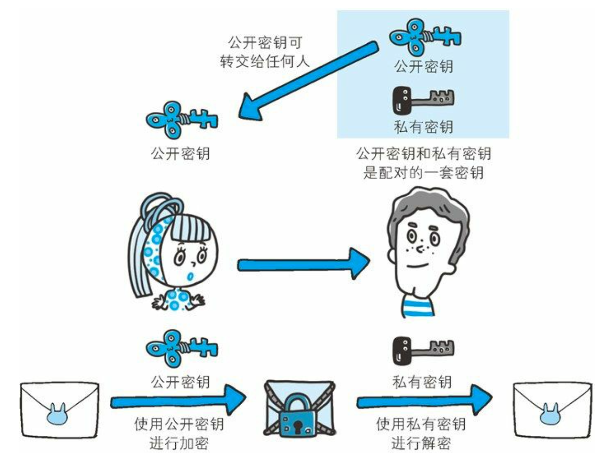

# HTTPS

> 写在前面：适合初学者入门，其中对 HTTP 的头部介绍对 web 开发者不必完全阅读，我只学习了部分章节，对 HTTP 和 HTTPS 有了全面的认识，以及 web 攻击技术。

**HTTP+** 加密 **+** 认证 **+** 完整性保护 **=HTTPS**

**HTTPS** 是身披 **SSL** 外壳的 **HTTP**

HTTPS 并非是应用层的一种新协议。只是 HTTP 通信接口部分用 SSL(Secure Socket Layer)和 TLS(Transport Layer Security)协议代 替而已。

通常，HTTP 直接和 TCP 通信。当使用 SSL 时，则演变成先和 SSL 通 信，再由 SSL 和 TCP 通信了。简言之，所谓 HTTPS，其实就是身披 SSL 协议这层外壳的 HTTP。

在采用 SSL 后，HTTP 就拥有了 HTTPS 的加密、证书和完整性保护 这些功能。

## 相互交换密钥的公开密钥加密技术

SSL 采用一种叫做**公开密钥加密(Public-key cryptography)**的加密处理方式。 近代的加密方法中加密算法是公开的，而密钥却是保密的。通过这种方式得以保持加密方法的安全性。

加密和解密都会用到密钥。没有密钥就无法对密码解密，反过来说， 任何人只要持有密钥就能解密了。如果密钥被攻击者获得，那加密也 就失去了意义。

### 共享密钥加密的困境

加密和解密同用一个密钥的方式称为共享密钥加密(Common key crypto system)，也被叫做**对称密钥加密**。

以共享密钥方式加密时必须将密钥也发给对方。

## 使用两把密钥的公开密钥加密

公开密钥加密方式很好地解决了共享密钥加密的困难。

公开密钥加密使用一对非对称的密钥。一把叫做私有密钥 (private key)，另一把叫做公开密钥(public key)。顾名思 义，私有密钥不能让其他任何人知道，而公开密钥则可以随意发 布，任何人都可以获得。

使用公开密钥加密方式，发送密文的一方使用对方的公开密钥进 行加密处理，对方收到被加密的信息后，再使用自己的私有密钥 进行解密。利用这种方式，不需要发送用来解密的私有密钥，也 不必担心密钥被攻击者窃听而盗走。

另外，要想根据密文和公开密钥，恢复到信息原文是异常困难 的，因为解密过程就是在对离散对数进行求值，这并非轻而易举 就能办到。退一步讲，如果能对一个非常大的整数做到快速地因 式分解，那么密码破解还是存在希望的。但就目前的技术来看是 不太现实的。

## **HTTPS** 采用混合加密机制

HTTPS 采用共享密钥加密和公开密钥加密两者并用的混合加密机制。若密钥能够实现安全交换，那么有可能会考虑仅使用公开密钥加密来通信。但是公开密钥加密与共享密钥加密相比，其处 理速度要慢。

所以应充分利用两者各自的优势，将多种方法组合起来用于通信。在交换密钥环节使用公开密钥加密方式，之后的建立通信交换报文阶段则使用共享密钥加密方式。

解释：

1. 某网站拥有用于非对称加密的公钥 A、私钥 A’。
2. 浏览器像网站服务器请求，服务器把公钥 A 明文给传输浏览器。
3. 浏览器随机生成一个用于对称加密的密钥 X，用公钥 A 加密后传给服务器。
4. 服务器拿到后用私钥 A’解密得到密钥 X。
5. 这样双方就都拥有密钥 X 了，且别人无法知道它。之后双方所有数据都用密钥 X 加密解密。

## 证明公开密钥正确性的证书

遗憾的是，公开密钥加密方式还是存在一些问题的。那就是无法证明公开密钥本身就是货真价实的公开密钥。比如，正准备和某台服务器建立公开密钥加密方式下的通信时，如何证明收到的公开密钥就是原本预想的那台服务器发行的公开密钥。或许在公开密钥传输途中，真正的公开密钥已经被攻击者替换掉了。

为了解决上述问题，可以使用由数字证书认证机构(CA，Certificate Authority)和其相关机关颁发的公开密钥证书。

## **HTTPS** 的安全通信机制

步骤 **1**: 客户端通过发送 Client Hello 报文开始 SSL 通信。报文中包含客户端支持的 SSL 的指定版本、加密组件(Cipher Suite)列表(所使用的加密算法及密钥长度等)。

步骤 **2**: 服务器可进行 SSL 通信时，会以 Server Hello 报文作为应答。和客户端一样，在报文中包含 SSL 版本以及加密组件。服务器的加密组件内容是从接收到的客户端加密组件内筛选出来的。

步骤 **3**: 之后服务器发送 Certificate 报文。报文中包含公开密钥证书。

步骤 **4**: 最后服务器发送 Server Hello Done 报文通知客户端，最初阶段的 SSL 握手协商部分结束。

步骤 **5**: SSL 第一次握手结束之后，客户端以 Client Key Exchange 报文作为回应。报文中包含通信加密中使用的一种被称为 Pre-master secret 的随机密码串。该报文已用步骤 3 中的公开密钥进行加密。

步骤 **6**: 接着客户端继续发送 Change Cipher Spec 报文。该报文会提示服务器，在此报文之后的通信会采用 Pre-master secret 密钥加密。

步骤 **7**: 客户端发送 Finished 报文。该报文包含连接至今全部报文的整体校验值。这次握手协商是否能够成功，要以服务器是否能够正确解密该报文作为判定标准。

步骤 **8**: 服务器同样发送 Change Cipher Spec 报文。

步骤 **9**: 服务器同样发送 Finished 报文。

步骤 **10**: 服务器和客户端的 Finished 报文交换完毕之后，SSL 连接就算建立完成。当然，通信会受到 SSL 的保护。从此处开始进行应用层协议的通信，即发送 HTTP 请求。

步骤 **11**: 应用层协议通信，即发送 HTTP 响应。

步骤 **12**: 最后由客户端断开连接。断开连接时，发送 close_notify 报文。上图做了一些省略，这步之后再发送 TCP FIN 报文来关闭与 TCP 的通信。
