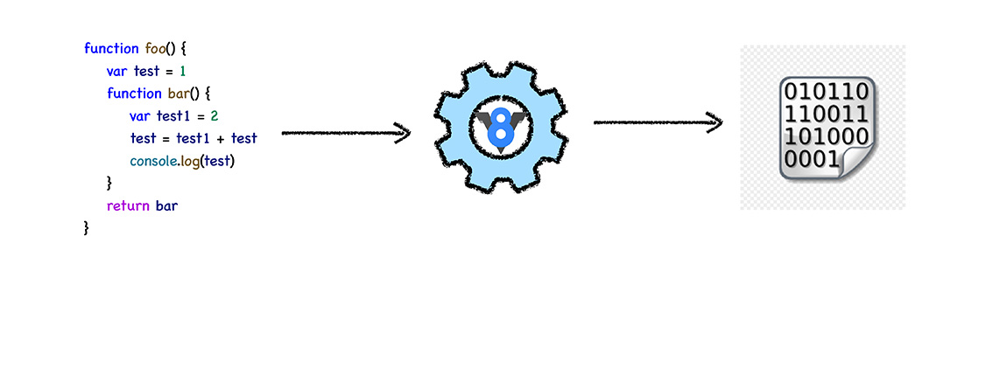
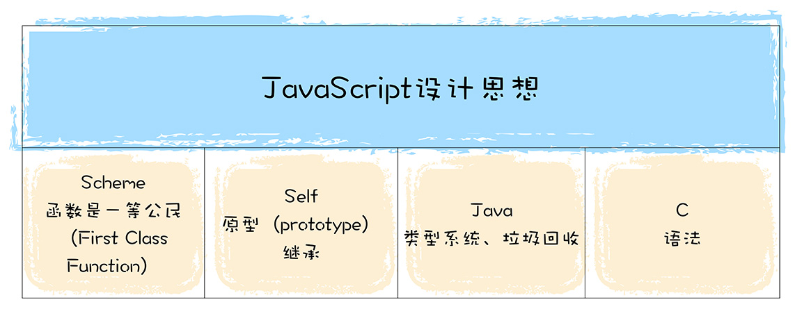
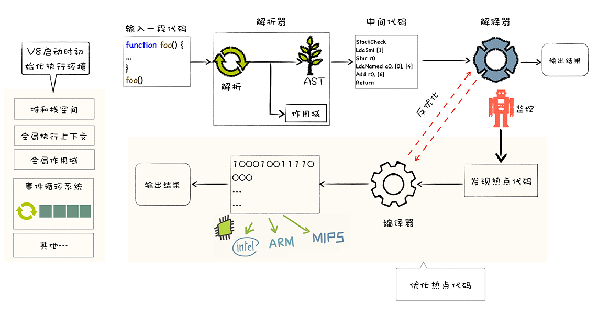
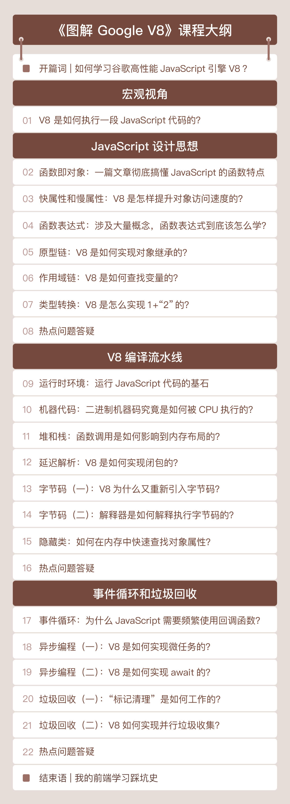

你好，我是李兵，《浏览器工作原理与实践》专栏的作者。在浏览器专栏中，我们对浏览器的工作原理进行了详细的介绍，其中也提到了 V8 是如何执行 JavaScript 代码的。很多朋友对这部分的学习意犹未尽，因此我又回到了极客时间，与你深入聊聊 V8。

## 什么是 V8？

V8 是 JavaScript 虚拟机的一种。我们可以简单地把 JavaScript 虚拟机理解成是一个翻译程序，将人类能够理解的**编程语言 JavaScript**，翻译成机器能够理解的**机器语言**。如下图所示：

上图中，中间的“黑盒”就是 JavaScript 引擎 V8。目前市面上有很多种 JavaScript 引擎，诸如 SpiderMonkey、V8、JavaScriptCore 等。而由谷歌开发的开源项目 V8 是当下使用最广泛的 JavaScript 虚拟机，全球有超过 25 亿台安卓设备，而这些设备中都使用了 Chrome 浏览器，所以我们写的 JavaScript 应用，大都跑在 V8 上。

V8 之所以拥有如此庞大的生态圈，也和它许多革命性的设计是分不开的。

在 V8 出现之前，所有的 JavaScript 虚拟机所采用的都是解释执行的方式，这是 JavaScript 执行速度过慢的一个主要原因。而 V8 率先引入了即时编译（JIT）的双轮驱动的设计，这是一种权衡策略，混合编译执行和解释执行这两种手段，给 JavaScript 的执行速度带来了极大的提升。

V8 出现之后，各大厂商也都在自己的 JavaScript 虚拟机中引入了 JIT 机制，所以你会看到目前市面上 JavaScript 虚拟机都有着类似的架构。另外，V8 也是早于其他虚拟机引入了惰性编译、内联缓存、隐藏类等机制，进一步优化了 JavaScript 代码的编译执行效率。

可以说，V8 的出现，将 JavaScript 虚拟机技术推向了一个全新的高度。

即便 V8 具有诸多优点，但我相信对于大部分同学来说，V8 虚拟机还只是一个黑盒，我们将一段代码丢给这个黑盒，它便会返回结果，并没有深入了解过它的工作原理。

如果只是单纯使用 JavaScript 和调用 Web API，并不了解虚拟机内部是怎样工作的，在项目中遇到的很多问题很可能找不到解决的途径。比如，有时项目的占用内存过高，或者页面响应速度过慢，又或者使用 Node.js 的时候导致任务被阻塞等问题，都与 V8 的基本运行机制有关。如果你熟悉 V8 的工作机制，就会有系统性的思路来解决这些问题。

另外，V8 的主要功能，就是结合 JavaScript 语言的特性和本质来编译执行它。通过深入地学习 V8，你对 JavaScript 语言本质和设计思想会有很直观的感受。这些设计思想像是更加高级的工具，你掌握了它，就可以提升你的语言使用和架构设计水平。

## 如何学习 V8？

那么，我们应该如何来学习 V8 呢？

刚刚我们也说过，V8 的主要职责是用来执行 JavaScript 代码的，那我们首先需要先了解 JavaScript 这门语言的基本特性和设计思想。

JavaScript 借鉴了很多语言的特性，比如 C 语言的基本语法、Java 的类型系统和内存管理、Scheme 的函数作为一等公民，还有 Self 基于原型（prototype）的继承机制。毫无疑问，JavaScript 是一门非常优秀的语言，特别是“原型继承机制”和“函数是一等公民”这两个设计。

不过 JavaScript 也是一门处处是坑的语言，由于历史原因，很多错误的或者不合理的设计都被延续至今，比如使用 new 加构造函数来创建对象，这种方式的背后隐藏了太多的细节，非常容易增加代码出错概率，而且也大大增加了新手的学习成本；再比如初期的 JavaScript 没有块级作用域机制，使得 JavaScript 需要采取变量提升的策略，而变量提升又是非常反人性的设计。

V8 是 JavaScript 的实现，在学习 V8 工作原理时，我们就要格外关注 JavaScript 这些独特的设计思想和特性背后的实现。比如，为了实现函数是一等公民的特性，JavaScript 采取了基于对象的策略；再比如为了实现原型继承，V8 为每个对象引入了 **proto** 属性。

**深入分析过 JavaScript 语言之后，我们就可以学习 V8 执行 JavaScript 代码的完整流程了**。我们把这套流程称之为 V8 的编译流水线，其完整流程如下图所示：

编译流水线本身并不复杂，但是其中涉及到了很多技术，诸如 JIT、延迟解析、隐藏类、内联缓存等等。这些技术决定着一段 JavaScript 代码能否正常执行，以及代码的执行效率。

比如 V8 中使用的隐藏类（Hide Class），这是将 JavaScript 中动态类型转换为静态类型的一种技术，可以消除动态类型的语言执行速度过慢的问题，如果你熟悉 V8 的工作机制，在你编写 JavaScript 时，就能充分利用好隐藏类这种强大的优化特性，写出更加高效的代码。

再比如，V8 实现了 JavaScript 代码的惰性解析，目的是为了加速代码的启动速度，通过对惰性解析机制的学习，你可以优化你的代码更加适应这个机制，从而提高程序性能。

要想充分了解 V8 是怎么工作的，除了要分析编译流水线，我们还需要了解另外两个非常重要的特性，那就是**事件循环系统**和**垃圾回收机制。**

事件循环系统和 JavaScript 中的难点——异步编程特性紧密相关。我们知道，JavaScript 是单线程的，JavaScript 代码都是在一个线程上执行，如果同一时间发送了多个 JavaScript 执行的请求，就需要排队，也就是进行异步编程。

V8 的事件循环系统会调度这些排队任务，保证 JavaScript 代码被 V8 有序地执行。因此也可以说，事件循环系统就是 V8 的心脏，它驱动了 V8 的持续工作。

另外，JavaScript 是一种自动垃圾回收的语言，V8 在执行垃圾回收时，会占用主线程的资源，如果我们编写的程序频繁触发垃圾回收，那么无疑会阻塞主线程，这也是我们经常会遇到的一个问题。你需要知道 V8 是如何分配内存数据的，以及这些数据是如何被回收的，打通整个链路，建立完整的系统，当下次遇到内存问题时，就知道如何去排查了。

以上，就是系统学习 V8 的路径。在我们这一季的课程中，也会按照这样的思路来设计课程，来帮助你学习到 V8 的完整的知识体系。

首先，我们会从 JavaScript 的设计思想讲起，讨论它背后的一些主要特性，以及 V8 是怎么实现这些特性的。

然后，我们再来分析 V8 的编译流水线，在课程中间我们还会穿插介绍一些内存分配相关的内容，因为函数调用、变量声明、参数传递或者函数返回数值都涉及到了内存分配。

最后，我们会介绍事件循环系统和垃圾回收系统的工作机制。

虽然本课程的篇幅不多，但是也具有一定的深度和广度。不过你并不需要担心内容太难，我会尽量将每节内容做到深入浅出，有什么问题你可以在留言区提问，我看到后都会第一时间来解答。

另外，在每个模块结束后，我会做一次热点问题的答疑，尽量帮你扫清学习 V8 的障碍。你需要做的是持之以恒地学习、反思与实践。

加油，从今天起，就让我们一起开始 V8 的学习旅程吧！
