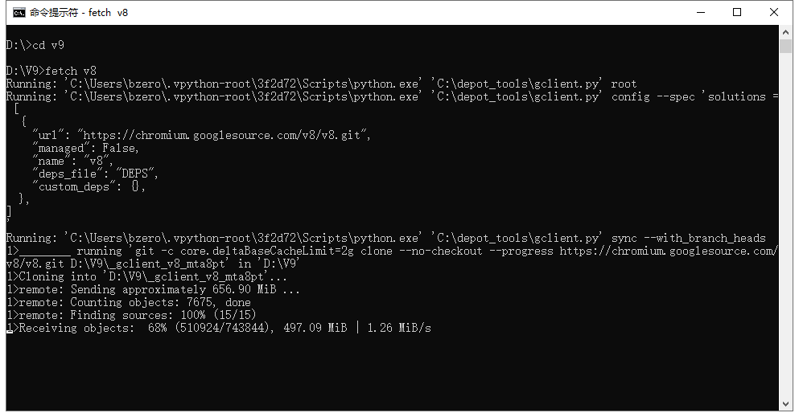
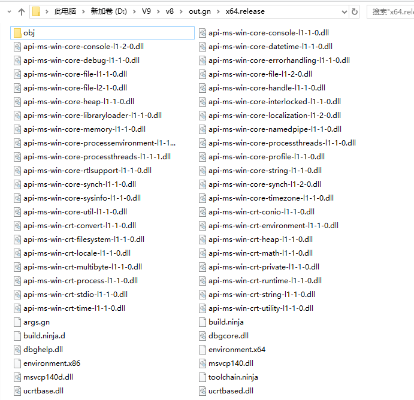
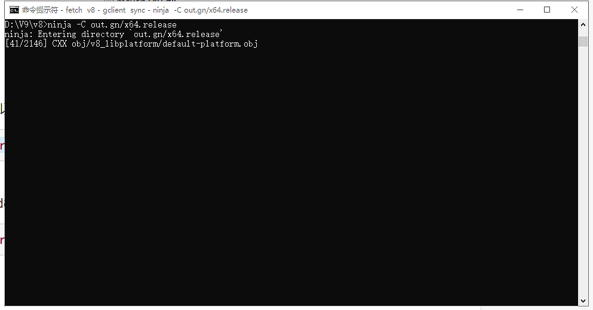
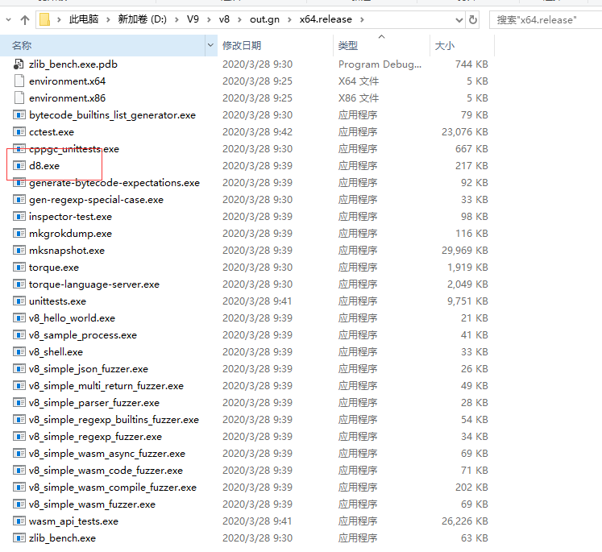
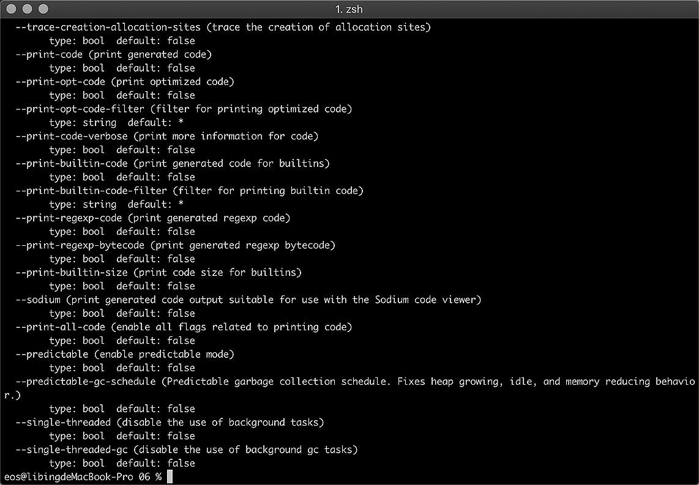
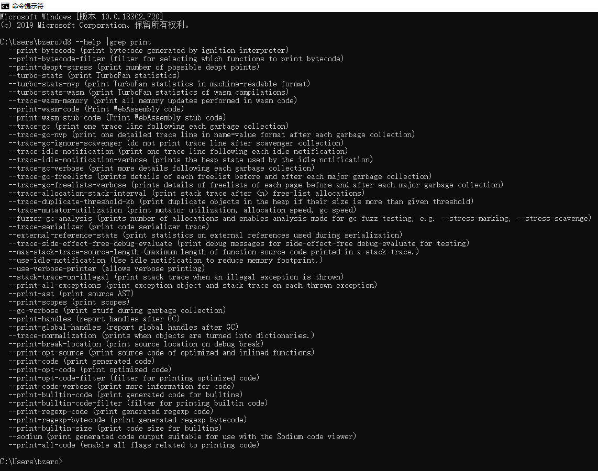
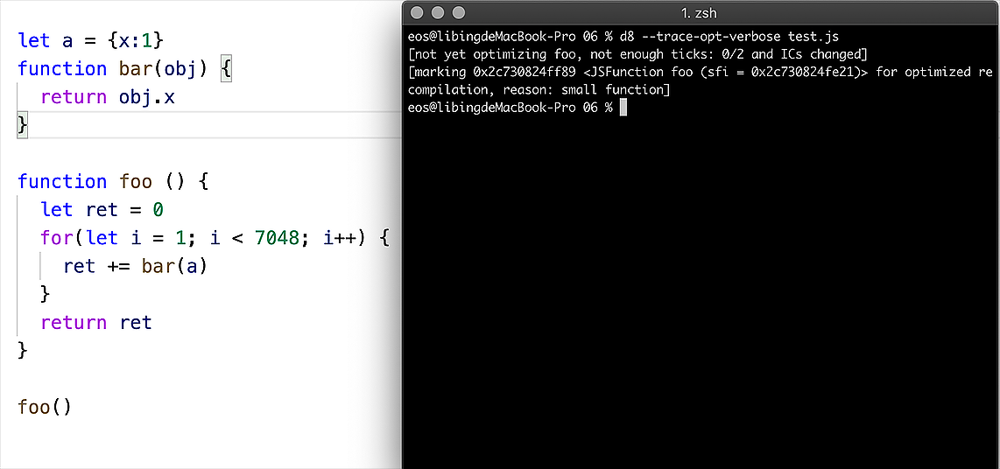
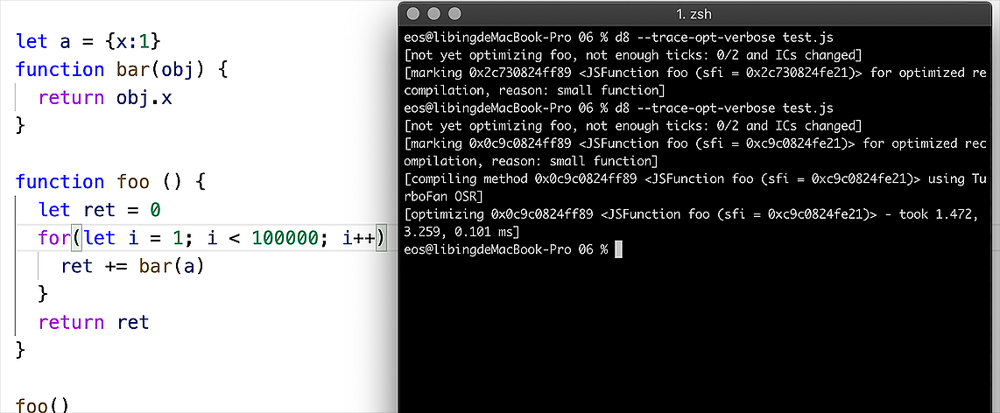
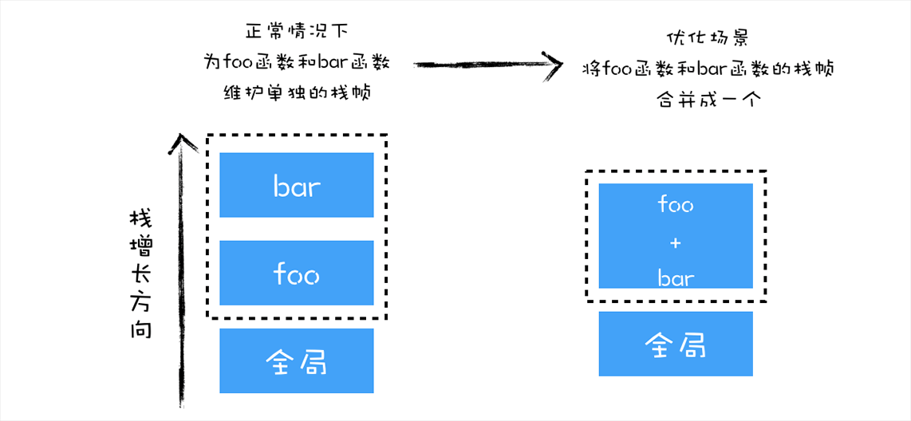
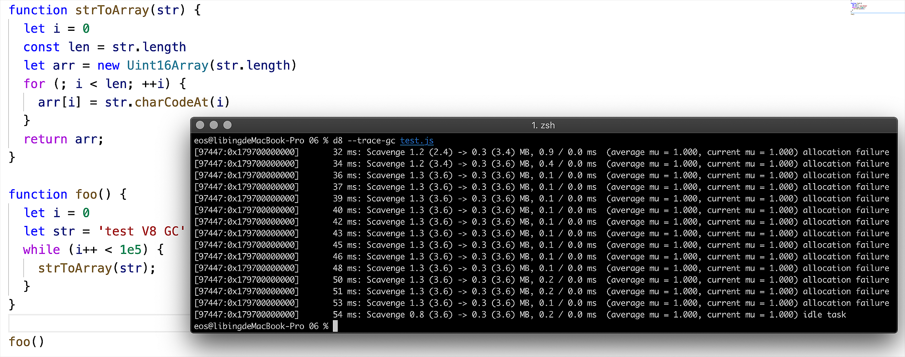

今天是我们第一单元的答疑环节，课后有很多同学留言问我关于 d8 的问题，所以今天我们就来专门讲讲，如何构建和使用 V8 的调试工具 d8。

d8 是一个非常有用的调试工具，你可以把它看成是 debug for V8 的缩写。我们可以使用 d8 来查看 V8 在执行 JavaScript 过程中的各种中间数据，比如作用域、AST、字节码、优化的二进制代码、垃圾回收的状态，还可以使用 d8 提供的私有 API 查看一些内部信息。

## 如何通过 V8 的源码构建 D8？

通常，我们没有直接获取 d8 的途径，而是需要通过编译 V8 的源码来生成 d8，接下来，我们就先来看看如何构建 d8。

其实并不难，总的来说，大体分为三部分。首先我们需要先下载 V8 的源码，然后再生成工程文件，最后编译 V8 的工程并生成 d8。

接下来我们就来具体操作一下。考虑到使用 Windows 系统的同学比较多，所以下面的操作，我们的默认环境是 Windows 系统，mac OS 和 Liunx 的配置会简单一些。

### 安装 VPN

V8 并不是一个单一的版本库，它还引用了很多第三方的版本库，大多是版本库我们都无法直接访问，所以，在下载代码过程中，你得先准备一个 VPN。

### 下载编译工具链：depot_tools

有了 VPN，接下来我们需要下载编译工具链：**depot_tools**，后续 V8 源码的下载、配置和编译都是由 depot_tools 来完成的，你可以直接点击下载：depot_tools bundle。

depot_tools 压缩包下载到本地之后，解压压缩包，比如你解压到以下这个路径中：

```bash
C:\src\depot_tools
```

然后需要将这个路径添加到环境变量中，这样我们就可以在控制台中使用 gclient 了。

### 设置环境变量

接下来，还需要往系统环境变量中添加变量 DEPOT_TOOLS_WIN_TOOLCHAIN ，值设为 0。

```bash
DEPOT_TOOLS_WIN_TOOLCHAIN = 0
```

这个环境变量的作用是告诉 deppt_tools，使用本地已安装的默认的 Visual Studio 版本去编译，否则 depot_tools 会使用 Google 内部默认的版本。

然后你可以在命令行中测试下是否可以使用：

```bash
gclient sync
```

### 安装 VS2019

在 Windows 系统下面，depot_tools 使用了 VS2019，因为 VS2019 自带了编译 V8 的编译器，所以需要安装 VS2019 时，安装时，你需要选择以下两项内容：

Desktop development with C++；

MFC/ATL support。

因为编译 V8 时，使用了这两项所提供的基础开发环境。

### 下载 V8 源码

安装了 VS2019，接下来就可以使用 depot_tools 来下载 V8 源码了，具体下载命令如下所示：

```bash
d:
mkdir v8
cd v8
fetch v8
cd v8
```

执行这个命令就会开始下载 V8 源码，这个过程可能比较漫长，下载时间主要取决于你的网速和 VPN 的速度。



### 配置工程

代码下载完成之后，就需要配置工程了，我们使用 gn 来配置。

```bash
cd v8
gn gen out.gn/x64.release --args='is_debug=false target_cpu="x64" v8_target_cpu="arm64" use_goma=true'
```

如果是 mac 系统，你可以使用：

```bash
gn gen out/gn --ide=xcode
```

来生成工程。

gn 是一个跨平台的构建系统，用来构建 Ninja 工程，Ninja 是一个跨平台的编译系统，比如可以通过 gn 构建 Chromium 还有 V8 的工程文件，然后使用 Ninja 来执行编译，可以使用 gn 和 Ninja 来配合使用构建跨平台的工程，这些工程可以在 macOS、Linux、Windows 等平台上进行编译。在 gn 之前，Google 使用了 gyp 来构建，由于 gn 的效率更高，所以现在都在使用 gn。

下面我们来看下生成 V8 工程的一些基础配置项：

- is_debug = false 编译成 release 版本 ;
- is_component_build = true 编译成动态链接库而不是很大的可执行文件 ;
- symbol_level = 0 将所有的 debug 符号放在一起，可以加速二次编译，并加速链接过程 ;
- ide = vs2019 ide=xcode。

工程生成好之后，你就可以去 `v8\out.gn\x64.release` 这个目录下查看生成的工程文件。如下图所示：



### 编译 d8

生成了 d8 的工程配置文件，接下来就可以编译 d8 了，你可以使用下面的命令：

```bash
ninja -C out.gn/x64.release
```

如果想编译特定目标，比如 d8，可以使用下面的命令：

```bash
ninja -C out.gn/x64.release d8
```

这个命令只会编译和 d8 所依赖的工程，然后就开始执行编译流程了。如下图所示：



编译时间取决于你硬盘读写速度和 CPU 的个数，比如我的电脑是 10 核 CPU，ssd 硬盘，整个编译过程大概花费了 15 分钟。

最终编译结束之后，你就可以去 v8\out.gn\x64.release 查看生成的文件，如下图所示：



我们可以看到 d8 也在其中。

我将编译出来的 d8 也放到了网上，如果你不想编译，也可以点击这里直接下载使用。

## 如何使用 d8？

好了，现在我们编译出来了 d8 ，接下来我们将 d8 所在的目录，v8\out.gn\x64.release 添加到环境变量“PATH”的路径中，这样我们就可以在控制台中使用 d8 了。

我们先来测试下能不能使用 d8，你可以使用下面这个命令，在控制台中执行 d8：

```bash
d8 --help
```

最终显示出来了一大堆命令，如下所示：



我们可以看到上图中打印出来了很多行，每一行其实都对应着一个命令，比如 print-bytecode 就是查看生成的字节码，print-opt-code 是要查看优化后的代码，turbofan-stats 是打印出来优化编译器的一些统计数据的命令，每个命令后面都有一个括号，括号里面是介绍这个命令的具体用途。

使用 d8 进行调试方式如下：

```bash
d8 test.js --print-bytecode
```

d8 后面跟上文件名和要执行的命令，如果执行上面这行命令，就会打印出 test.js 文件所生成的字节码。

不过通过 d8 --help 打印出来的列表非常长，如果过滤特定的命令，你可以使用下面的命令来查看：

```bash
d8 --help |grep print
```

这样我们就能查看看 d8 有多少关于 print 的命令，如果你使用了 Windows 系统，可能缺少 grep 程序，你可以去这里下载。

安装完成之后，记得手动将 grep 程序所在的目录添加到环境变量 PATH 中，这样才能在控制台使用 grep 命令。

最终打印出来带有 print 字样的命令，包含以下内容：



d8 的命令很多，如果有时间，你可以逐一试下。接下来下面我们挑其中一些重点的命令来介绍下，比如 trace-gc，trace-opt-verbose 。这些命令涉及到了编译流水线的中间数据，垃圾回收器执行状态等，熟悉使用这些命令可以帮助我们更加深刻理解编译流水线和垃圾回收器的执行状态。

在使用 d8 执行一段代码之前，你需要将你的 JavaScript 源码保存到一个 js 文件中，我们把所需要需要观察的代码都存放到 test.js 这个文件中。

### 打印优化数据

你可以使用–print-ast 来查看中间生成的 AST，使用—print-scope 来查看中间生成的作用域，–print-bytecode 来查看中间生成的字节码。除了这些数据之外，**我们还可以使用 d8 来打印一些优化的数据**，比如下面这样一段代码：

```js
let a = { x: 1 };
function bar(obj) {
  return obj.x;
}
function foo() {
  let ret = 0;
  for (let i = 1; i < 7049; i++) {
    ret += bar(a);
  }
  return ret;
}
foo();
```

当 V8 先执行到这段代码的时候，监控到 while 循环会一直被执行，于是判断这是一块热点代码，于是，V8 就会将热点代码编译为优化后的二进制代码，你可以通过下面的命令来查看：

```bash
d8 --trace-opt-verbose test.js
```

执行这段命令之后，提示如下所示：



观察上图，我们可以看到终端中出现了一段优化的提示：

```bash
<JSFunction foo (sfi = 0x2c730824fe21)> for optimized recompilation, reason: small function ]
```

这就是告诉我们，已经使用 TurboFan 优化编译器将函数 foo 优化成了二进制代码，执行 foo 时，实际上是执行优化过的二进制代码。

现在我们把 foo 函数中的循环加到 10 万，再来查看优化信息，最终效果如下图所示：



我们看到又出现了一条新的优化信息，新的提示信息如下：

```bash
<JSFunction foo (sfi = 0xc9c0824fe21)> using TurboFan OSR]
```

这段提示是说，由于循环次数过多，V8 采取了 TurboFan 的 OSR 优化，OSR 全称是 **On-Stack Replacement，**它是一种在运行时替换正在运行的函数的栈帧的技术，如果在 foo 函数中，每次调用 bar 函数时，都要创建 bar 函数的栈帧，等 bar 函数执行结束之后，又要销毁 bar 函数的栈帧。

通常情况下，这没有问题，但是在 foo 函数中，采用了大量的循环来重复调用 bar 函数，这就意味这 V8 需要不断为 bar 函数创建栈帧，销毁栈帧，那么这样势必会影响到 foo 函数的执行效率。

于是，V8 采用了 OSR 技术，将 bar 函数和 foo 函数合并成一个新的函数，具体你可以参考下图：



如果我在 foo 函数里面执行了 10 万次循环，在循环体内调用了 10 万次 bar 函数，那么 V8 会实现两次优化，第一次是将 foo 函数编译成优化的二进制代码，第二次是将 foo 函数和 bar 函数合成为一个新的函数。

网上有一篇介绍 OSR 的文章也不错，叫 on-stack replacement in v8，如果你感兴趣可以查看下。

### 查看垃圾回收

我们还可以通过 d8 来查看垃圾回收的状态，你可以参看下面这段代码：

```js
function strToArray(str) {
  let i = 0;
  const len = str.length;
  let arr = new Uint16Array(str.length);
  for (; i < len; ++i) {
    arr[i] = str.charCodeAt(i);
  }
  return arr;
}
function foo() {
  let i = 0;
  let str = 'test V8 GC';
  while (i++ < 1e5) {
    strToArray(str);
  }
}
foo();
```

上面这段代码，我们重复将一段字符串转换为数组，并重复在堆中申请内存，将转换后的数组存放在内存中。我们可以通过 trace-gc 来查看这段代码的内存回收状态，执行下面这段命令：

```bash
d8 --trace-gc test.js
```

最终打印出来的结果如下图所示：



你会看到一堆提示，如下：

```bash
Scavenge 1.2 (2.4) -> 0.3 (3.4) MB, 0.9 / 0.0 ms  (average mu = 1.000, current mu = 1.000) allocation failure
```

这句话的意思是提示“Scavenge … 分配失败”，是因为垃圾回收器 **Scavenge** 所负责的空间已经满了，Scavenge 主要回收 V8 中“**新生代**”中的内存，大多数对象都是分配在新生代内存中，内存分配到新生代中是非常快速的，但是新生代的空间却非常小，通常在 1 ～ 8 MB 之间，一旦空间被填满，Scavenge 就会进行“清理”操作。

上面这段代码之所以能频繁触发新生代的垃圾回收，是因为它频繁地去申请内存，而申请内存之后，这块内存就立马变得无效了，为了减少垃圾回收的频率，我们尽量避免申请不必要的内存，比如我们可以换种方式来实现上述代码，如下所示：

```bash
function strToArray(str, bufferView) {
  let i = 0
  const len = str.length
  for (; i < len; ++i) {
    bufferView[i] = str.charCodeAt(i);
  }
  return bufferView;
}
function foo() {
  let i = 0
  let str = 'test V8 GC'
  let buffer = new ArrayBuffer(str.length * 2)
  let bufferView = new Uint16Array(buffer);
  while (i++ < 1e5) {
    strToArray(str,bufferView);
  }
}
foo()
```

我们将 strToArray 中分配的内存块，提前到了 foo 函数中分配，这样我们就不需要每次在 strToArray 函数分配内存了，再次执行 trace-gc 的命令：

```bash
d8 --trace-gc test.js
```

我们就会看到，这时候没有任何垃圾回收的提示了，这也意味着这时没有任何垃圾分配的操作了。

### 内部方法

另外，你还可以使用 V8 所提供的一些内部方法，只需要在启动 V8 时传入 allow-natives-syntax 命令，具体使用方式如下所示：

```bash
d8 --allow-natives-syntax test.js
```

还记得我们在《03 ｜快属性和慢属性：V8 采用了哪些策略提升了对象属性的访问速度？》讲到的快属性和慢属性吗？

我们可以通过内部方法 HasFastProperties 来检查一个对象是否拥有快属性，比如下面这段代码：

```bash
function Foo(property_num,element_num) {
  //添加可索引属性
  for (let i = 0; i < element_num; i++) {
      this[i] = `element${i}`
  }
  //添加常规属性
  for (let i = 0; i < property_num; i++) {
      let ppt = `property${i}`
      this[ppt] = ppt
  }
}
var bar = new Foo(10,10)
console.log(%HasFastProperties(bar));
delete bar.property2
console.log(%HasFastProperties(bar));
```

我们执行：

```bash
d8  test.js --allow-natives-syntax
```

通过传入 allow-natives-syntax 命令，就能使用 HasFastProperties 这一类内部接口，默认情况下，我们知道 V8 中的对象都提供了快属性，不过使用了 delete bar.property2 之后，就没有快属性了，我们可以通过 HasFastProperties 来判断。

所以可以得出，使用 delete 时候，我们查找属性的速度就会变慢，这也是我们尽量不要使用 delete 的原因。

除了 HasFastProperties 方法之外，V8 提供的内部方法还有很多，比如你可以使用 GetHeapUsage 来查看堆的使用状态，可以使用 CollectGarbage 来主动触发垃圾回收，诸如 HaveSameMap、HasDoubleElements 等，具体命令细节你可以参考这里。

## 总结

好了，今天的内容就介绍到这里，我们来简单总结一下。

d8 是个非常有用的调试工具，能够帮助我们发现我们的代码是否可以被 V8 高效地执行，比如通过 d8 查看代码有没有被 JIT 编译器优化，还可以通过 d8 内置的一些接口查看更多的代码内部信息，而且通过使用 d8，我们会接触各种实际的优化策略，学习这些策略并结合 V8 的工作原理，可以让我们更加接地气地了解 V8 的工作机制。

通过源码来构建 d8 的流程比较简单，首先下载 V8 的编译工具链：depot_tools，然后再利用 depot_tools 下载源码、生成工程、编译工程，这就实现了通过源码编译 d8。这个过程不难，但涉及到了许多工具，在配置过程中可能会遇到一些坑，不过按照流程操作应该能顺利编译出来 d8。

接下来我们重点讨论了如何使用 d8，我们可以通过传入不同的命令，让 d8 来分析 V8 在执行 JavaScript 过程中的一些中间数据。你应该熟练掌握 d8 的使用方式，在后续课程中我们应该还会反复引用本节的一些内容。

## 思考题

c/c++ 中有内联 (Inline) 函数，和我们文中分析的 OSR 类似，内联函数和 V8 中所采用的 OSR 优化手段类似，都是在执行过程中将两个函数合并成一个，这样在执行代码的过程中，就减少了栈帧切换操作，增加了执行效率，那么今天留给你的思考题时，你认为在什么情况下，V8 会将多个函数合成一个函数？

你可以列举一个实际的列子，并使用 d8 来分析 V8 是否对你的列子进行了优化操作。欢迎你在留言区与我分享讨论。
