在上一节我们分析了 V8 的运行时环境，准备好了运行时环境，V8 就可以执行 JavaScript 代码了。在执行代码时，V8 需要先将 JavaScript 编译成字节码，然后再解释执行字节码，或者将需要优化的字节码编译成二进制，并直接执行二进制代码。

也就是说，V8 首先需要将 JavaScript 编译成字节码或者二进制代码，然后再执行。

在后续课程中，我们会分析 V8 如何解释执行字节码，以及执行编译好的二进制代码，不过在分析这些过程之前，我们需要了解最基础的知识，那就是 CPU 如何执行二进制代码。
因为字节码的执行模式和 CPU 直接执行二进制代码的模式是类似的，了解 CPU 执行二进制代码的过程，后续我们分析字节码的执行流程就会显得比较轻松，而且也能加深我们对计算机底层工作原理的理解。

今天我们就要来分析下二进制代码是怎么被 CPU 执行的，在编译流水线中的位置你可以参看下图：

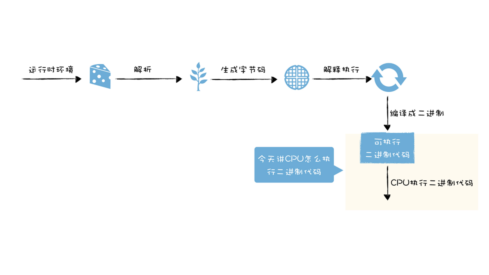

## 将源码编译成机器码

我们以一段 C 代码为例，来看一下代码被编译成二进制可执行程序之后，是如何被 CPU 执行的。

在这段代码中，只是做了非常简单的加法操作，将 x 和 y 两个数字相加得到 z，并返回结果 z。

```c

int main()
{
    int x = 1;
    int y = 2;
    int z = x + y;
    return z;
}
```

我们知道，CPU 并不能直接执行这段 C 代码，而是需要对其进行编译，将其转换为二进制的机器码，然后 CPU 才能按照顺序执行编译后的机器码。

那么我们先通过 **GCC 编译器**将这段 C 代码编译成二进制文件，你可以输入以下命令让其编译成目的文件：

```bash

gcc -O0 -o code_prog code.c
```

输入上面的命令之后回车，就可以在文件夹中生成名为 code_prog 的可执行程序，接下来我们再将编译出来的 code_prog 程序进行反汇编，这样我们就可以看到二进制代码和对应的汇编代码。你可以使用 objdump 的完成该任务，命令如下所示：

```bash

objdump -d code_prog
```

最后编译出来的机器码如下图所示：

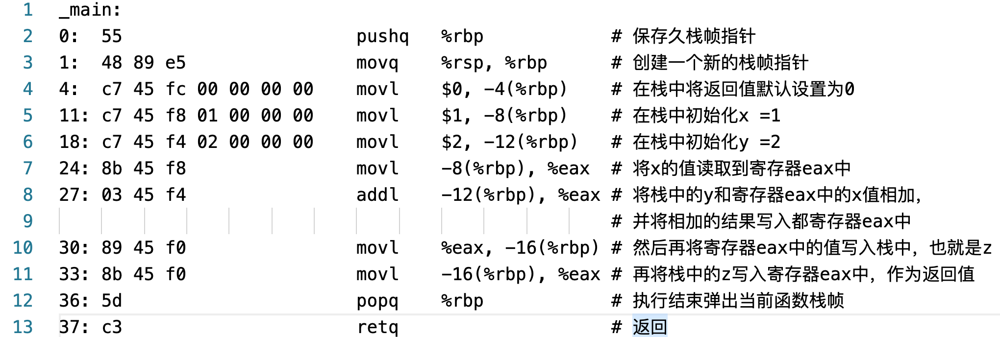

观察上图，左边就是编译生成的机器码，在这里它是使用十六进制来展示的，这主要是因为十六进制比较容易阅读，所以我们通常使用十六进制来展示二进制代码。你可以观察到上图是由很多行组成的，每一行其实都是一个指令，该指令可以让 CPU 执行指定的任务。

中间的部分是汇编代码，汇编代码采用**助记符（memonic）**来编写程序，例如原本是二进制表示的指令，在汇编代码中可以使用单词来表示，比如 mov、add 就分别表示数据的存储和相加。汇编语言和机器语言是一一对应的，这一点和高级语言有很大的不同。

通常我们将汇编语言编写的程序转换为机器语言的过程称为“**汇编**”；反之，机器语言转化为汇编语言的过程称为“**反汇编**”，比如上图就是对 code_prog 进程进行了反汇编操作。

另外，右边是我添加的注释，表示每条指令的具体含义，你可以对照着阅读。

这一大堆指令按照顺序集合在一起就组成了程序，所以程序的执行，本质上就是 CPU 按照顺序执行这一大堆指令的过程。

## CPU 是怎么执行程序的？

现在我们知道了编译后的程序是由一堆二进制代码组成的，也知道二进制代码是由一条条指令构成的，那么接下来我们就可以来分析 CPU 是如何执行这些指令的了。

不过为了分析程序的执行过程，我们还需要理解典型的计算机系统的硬件组织结构，具体你可以参看下图：

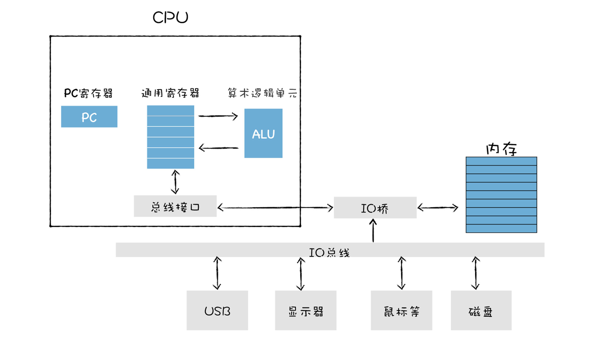

这张图是比较通用的系统硬件组织模型图，从图中我们可以看出，它主要是由 CPU、主存储器、各种 IO 总线，还有一些外部设备，诸如硬盘、显示器、USB 等设备组成的。

有了这张图，接下来我们就可以分析程序到底是怎么被执行的了。

**首先，在程序执行之前，我们的程序需要被装进内存**，比如在 Windows 下面，你可以通过鼠标点击一个可执行文件，当你点击该文件的时候，系统中的程序加载器会将该文件加载到内存中。

那么到底什么是内存呢？

你可以把内存看成是一个快递柜，比如当你需要寄件的时候，你可以打开快递柜中的第 100 号单元格，并存放你的物品，有时候你会收到快递，提示你在快递柜的 105 号单元格中，你就可以打开 105 号单元格取出的你的快递。

这里有三个重要的内容，分别是**快递柜**、**快递柜中的每个单元格的编号**、**操作快递柜的人**，你可以把它们对比成点算机中的**内存**、**内存地址**和 **CPU**。

也就是说，CPU 可以通过指定内存地址，从内存中读取数据，或者往内存中写入数据，有了内存地址，CPU 和内存就可以有序地交互。同时，从内存的角度理解地址也是非常重要的，这能帮助我们理解后续很多有深度的内容。

另外，内存还是一个临时存储数据的设备，之所以是临时的存储器，是因为断电之后，内存中的数据都会消失。

**内存中的每个存储空间都有其对应的独一无二的地址，**你也可以通过下图来直观地理解下内存中两个重要的概念，内存和地址：

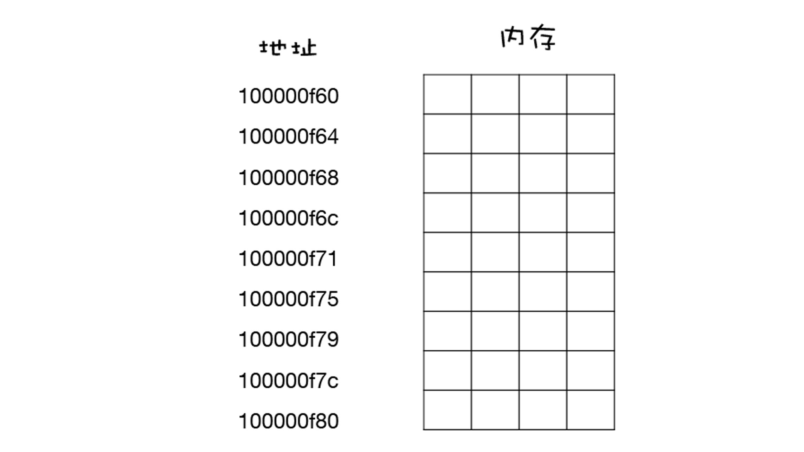

在内存中，每个存放字节的空间都有其唯一的地址，而且地址是按照顺序排放的，理解了内存和内存地址，接下来我们就可以继续往下分析了。

我们还是分析这节课开头的那段 C 代码，这段代码会被编译成可执行文件，可执行文件中包含了二进制的机器码，当二进制代码被加载进了内存后，那么内存中的每条二进制代码便都有了自己对应的地址，如下图所示：

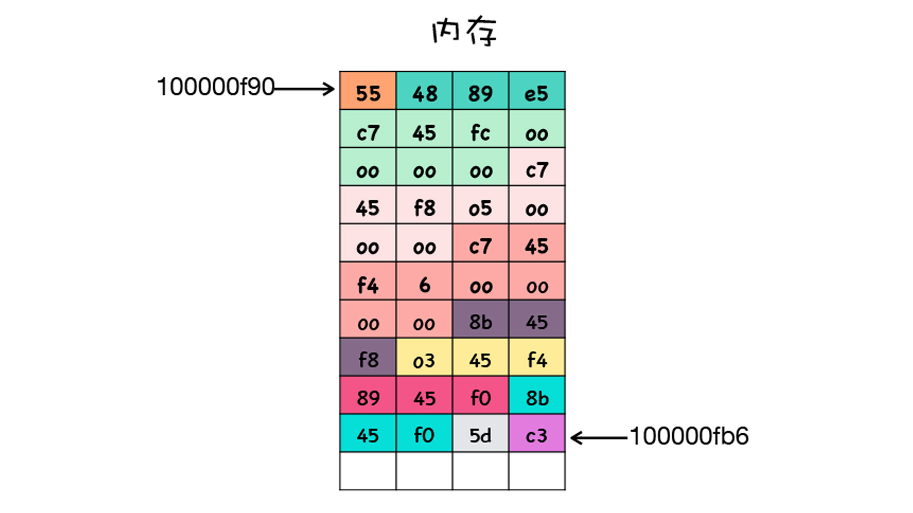

有时候一条指令只需要一个字节就可以了，但是有时候一条指令却需要多个字节。在上图中，对于同一条指令，我使用了相同的颜色来标记，我们可以把上面这个一堆二进制数据反汇编成一条条指令的形式，这样可以方便我们的阅读，效果如下图所示：

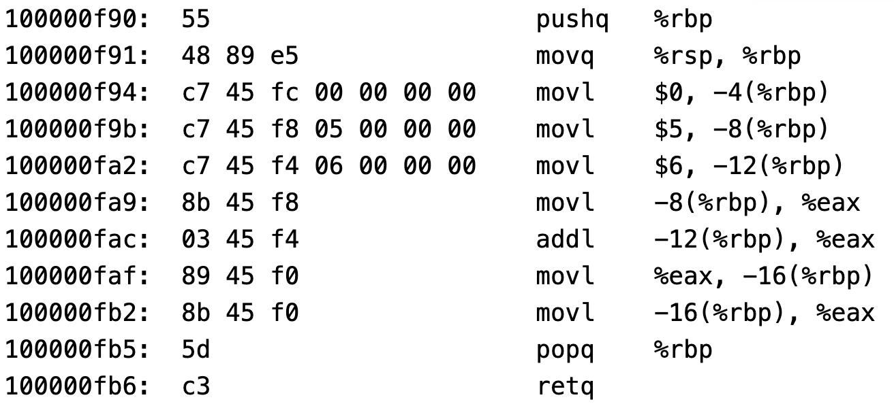

好了，一旦二进制代码被装载进内存，CPU 便可以从内存中**取出一条指令**，然后**分析该指令**，最后**执行该指令**。

我们把取出指令、分析指令、执行指令这三个过程称为一个 **CPU 时钟周期**。CPU 是永不停歇的，当它执行完成一条指令之后，会立即从内存中取出下一条指令，接着分析该指令，执行该指令，CPU 一直重复执行该过程，直至所有的指令执行完成。

也许你有这样的疑问，CPU 是怎么知道要取出内存中的哪条指令呢？要解答这个问题，我们先看下图：

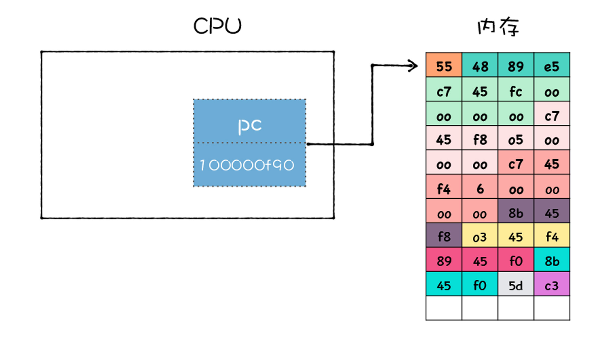

观察上图，我们可以看到 CPU 中有一个 PC 寄存器，它保存了将要执行的指令地址，当二进制代码被装载进了内存之后，系统会将二进制代码中的第一条指令的地址写入到 PC 寄存器中，到了下一个时钟周期时，CPU 便会根据 **PC 寄存器**中的地址，从内存中取出指令。

PC 寄存器中的指令取出来之后，系统要做两件事：

第一件是将下一条指令的地址更新到 PC 寄存器中，比如上图中，CPU 将第一个指令 55 取出来之后，系统会立即将下一个指令的地址填写到 PC 寄存器中，上个寄存器的地址是 100000f90，那么下一条指令的地址就是 100000f91 了，如下图所示：

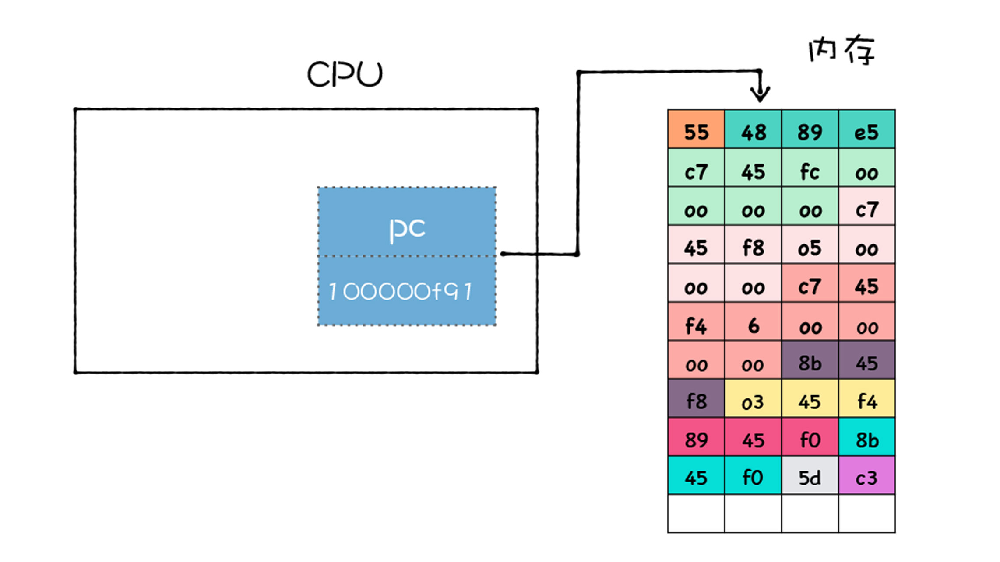

更新了 PC 寄存器之后，CPU 就会立即做第二件事，那就是**分析该指令**，并识别出不同的类型的指令，以及各种获取操作数的方法。在指令分析完成之后，就要执行指令了。不过要了解 CPU 是如何执行指令的，我们还需要了解 CPU 中的一个重要部件：**通用寄存器。**

通用寄存器是 CPU 中用来存放数据的设备，不同处理器中寄存器的个数也是不一样的，之所要通用寄存器，是因为 CPU 访问内存的速度很慢，所以 CPU 就在内部添加了一些存储设备，这些设备就是通用寄存器。

你可以把通用寄存器比喻成是你身上的口袋，内存就是你的背包，而硬盘则是你的行李箱，要从背包里面拿物品会比较不方便，所以你会将常用的物品放进口袋。你身上口袋的个数通常不会太多，容量也不会太大，而背包就不同了，它的容量会非常大。

我们可以这样总结通用寄存器和内存的关系：**通用寄存器容量小，读写速度快，内存容量大，读写速度慢。**

通用寄存器通常用来存放数据或者内存中某块数据的地址，我们把这个地址又称为指针，通常情况下寄存器对存放的数据是没有特别的限制的，比如某个通用寄存器既可以存储数据，也可以存储指针。

不过由于历史原因，我们还会将某些专用的数据或者指针存储在专用的通用寄存器中 ，比如 rbp 寄存器通常用来存放栈帧指针的，rsp 寄存器用来存放栈顶指针的，PC 寄存器用来存放下一条要执行的指令等。

现在我们理解了什么是通用寄存器了，接下来我们就可以分析 CPU 是如何执行指令的了，我们先来了解下几种常用的指令类型：

第一种是**加载的指令**，其作用是从内存中复制指定长度的内容到通用寄存器中，并覆盖寄存器中原来的内容。你可以参看下图：

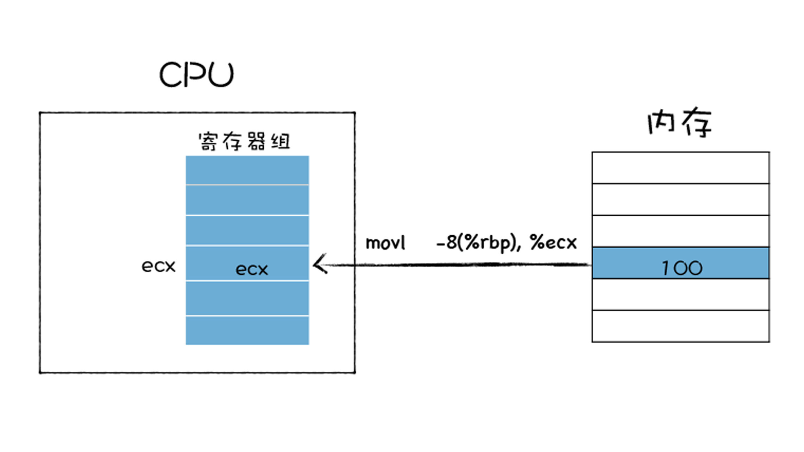

比如上图使用了 **movl** 指令，指令后面跟着的第一个参数是要拷贝数据的内存的位置，第二个参数是要拷贝到 ecx 这个寄存器。

第二种**存储的指令**，和加载类型的指令相反，其作用是将寄存器中的内容复制内存某个位置，并覆盖掉内存中的这个位置上原来的内容。你可以参看下图：

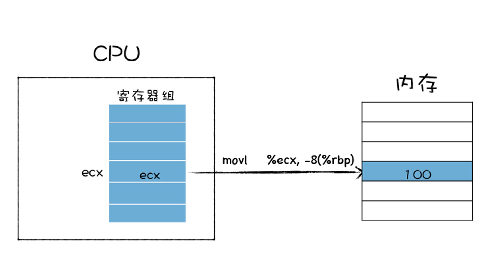

上图也是使用 movl 指令，movl 指令后面的 %ecx 就是寄存器地址，-8(%rbp) 是内存中的地址，这条指令的作用是将寄存器中的值拷贝到内存中。

第三种是**更新指令**，其作用是复制两个寄存器中的内容到 ALU 中，也可以是一块寄存器和一块内存中的内容到 ALU 中，ALU 将两个字相加，并将结果存放在其中的一个寄存器中，并覆盖该寄存器中的内容。具体流程如下图所示：

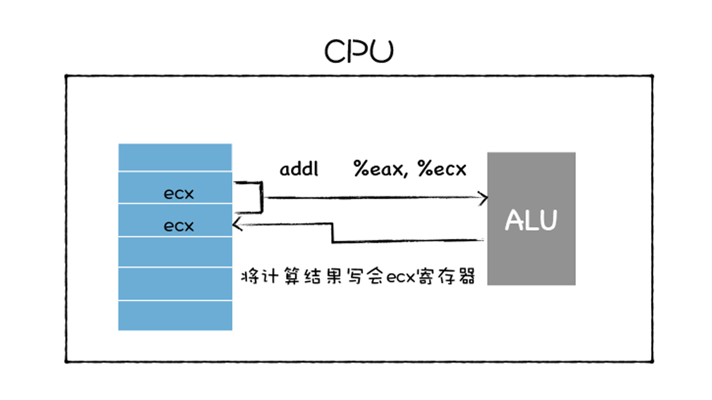

参看上图，我们可以发现 addl 指令，将寄存器 eax 和 ecx 中的值传给 ALU，ALU 对它们进行相加操纵，并将计算的结果写回 ecx。

还有一个非常重要的指令，是跳转指令，从指令本身抽取出一个字，这个字是下一条要执行的指令的地址，并将该字复制到 PC 寄存器中，并覆盖掉 PC 寄存器中原来的值。那么当执行下一条指令时，便会跳转到对应的指令了。

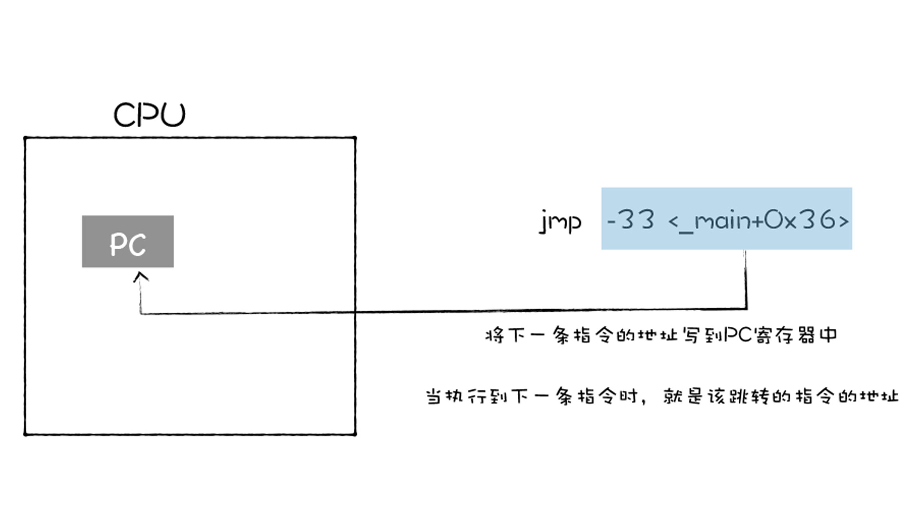

观察上图，上图是通过 jmp 来实现的，jmp 后面跟着要跳转的内存中的指令地址。

除了以上指令之外，还有 IO 读 / 写指令，这些指令可以从一个 IO 设备中复制指定长度的数据到寄存器中，也可以将一个寄存器中的数据复制到指定的 IO 设备。

以上就是一些基础的指令类型，这些指令像积木，利用它们可以搭建我们现在复杂的软件大厦。

## 分析一段汇编代码的执行流程

好了，了解指令的类型，接下来我们就可以分析上面那段简单的程序的执行过程了，不过在这里还有一些前置的知识没有介绍，比如内存中的栈、栈帧的概念，这些内容我会在下一节详细介绍。本节中如果提到了栈和栈帧，你可以将它们看成是内存中的一块区域即可。

在 C 程序中，CPU 会首先执行调用 main 函数，在调用 main 函数时，CPU 会保存上个栈帧上下文信息和创建当前栈帧的上下文信息，主要是通过下面这两条指令实现的：

```bash
pushq   %rbp
movq    %rsp, %rbp
```

第一条指令 pushq %rbp，是将 rbp 寄存器中的值写到内存中的栈区域。第二条是将 rsp 寄存器中的值写到 rbp 寄存器中。

然后将 0 写到栈帧的第一个位置，对应的汇编代码如下：

```bash

movl  $0, -4(%rbp)
```

接下来给 x 和 y 赋值，对应的代码是下面两行：

```bash

movl  $1, -8(%rbp)
movl  $2, -12(%rbp)
```

第一行指令是将常数值 1 压入到栈中，然后再将常数值 2 压入到栈中，这两个只分别对应着 x 和 y。

接下来，x 的值从栈中复制到 eax 寄存器中，对应的指令如下所示：

```bash

movl  -8(%rbp), %eax
```

现在 eax 寄存器中保存了 x 的值，那么接下来，再将内存中的 y 和 eax 中的 x 相加，相加的结果再保存在 eax 中，对应的指令如下所示：

```bash

addl  -12(%rbp), %eax
```

现在 x+y 的结果保存在了 eax 中了，接下来 CPU 会将结果保存中内存中，执行如下指令：

```bash
 movl  %eax, -16(%rbp)
```

最后又将结果 z 加载到 eax 寄存器中，代码如下所示：

```bash

movl  -16(%rbp), %eax
```

注意这里的 eax 寄存器中的内容就被默认作为返回值了，执行到这里函数基本就执行结束了，然后需要继续执行一些恢复现场的操作，代码如下所示：

```bash
popq  %rbp
retq
```

到了这里，我们整个程序就执行结束了。

## 总结

今天这节课，我们的主要目的是讲清楚 CPU 是怎么执行一段二进制代码的，这涉及到了 CPU、寄存器、运算器、编译、汇编等一系列的知识。

我们从如何执行一段 C 代码讲起，由于 CPU 只能执行机器代码，所以我们需要将 C 代码转换为机器代码，这个转换过程就是由 C 编译器完成的。

CPU 执行机器代码的逻辑非常简单，首先编译之后的二进制代码被加载进内存，然后 CPU 就按照指令的顺序，一行一行地执行。

在执行指令的过程中，CPU 需要对数据执行读写操作，如果直接读写内存，那么会严重影响程序的执行性能，因此 CPU 就引入了寄存器，将一些中间数据存放在寄存器中，这样就能加速 CPU 的执行速度。

有了寄存器之后，CPU 执行指令的操作就变得复杂了一点，因为需要寄存器和内存之间传输数据，或者寄存器和寄存器之间传输数据。我们通常有以下几种方式来使用寄存器，这包括了**加载指令、存储指令、更新指令。**通过配合这几种类型的指令，我们就可以实现完整的程序功能了。

## 思考题

你能用自己的语言复述下 CPU 是怎么执行一段二进制机器代码的吗？欢迎你在留言区与我分享讨论。

1. 二进制代码装载进内存，系统会将第一条指令的地址写入到 PC 寄存器中。
2. 读取指令：根据 pc 寄存器中地址，读取到第一条指令，并将 pc 寄存器中内容更新成下一条指令地址。
3. 分析指令：并识别出不同的类型的指令，以及各种获取操作数的方法。
4. 执行指令：由于 cpu 访问内存花费时间较长，因此 cpu 内部提供了通用寄存器，用来保存关....
