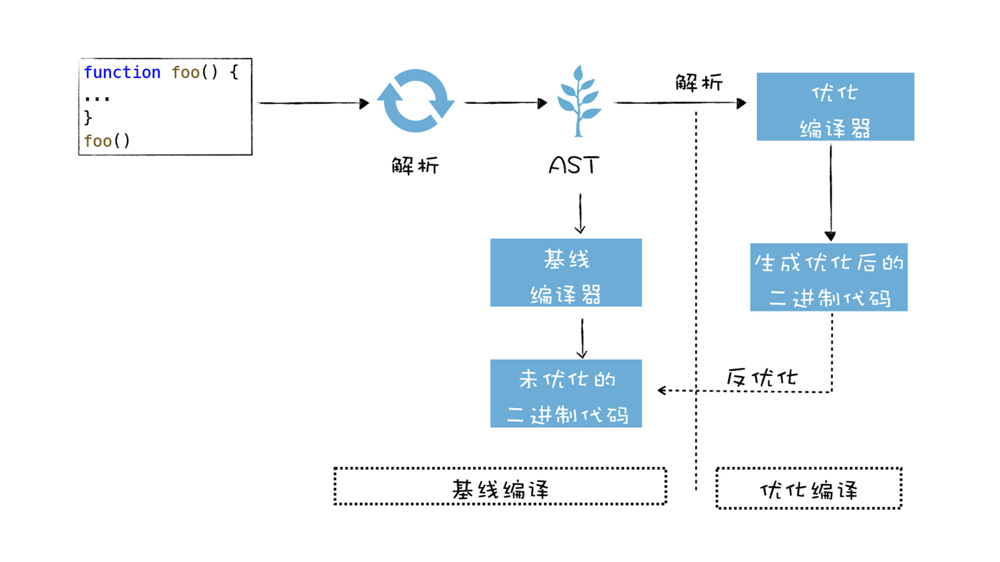
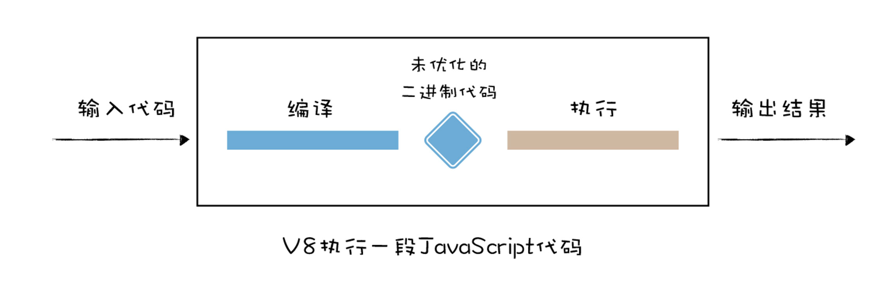
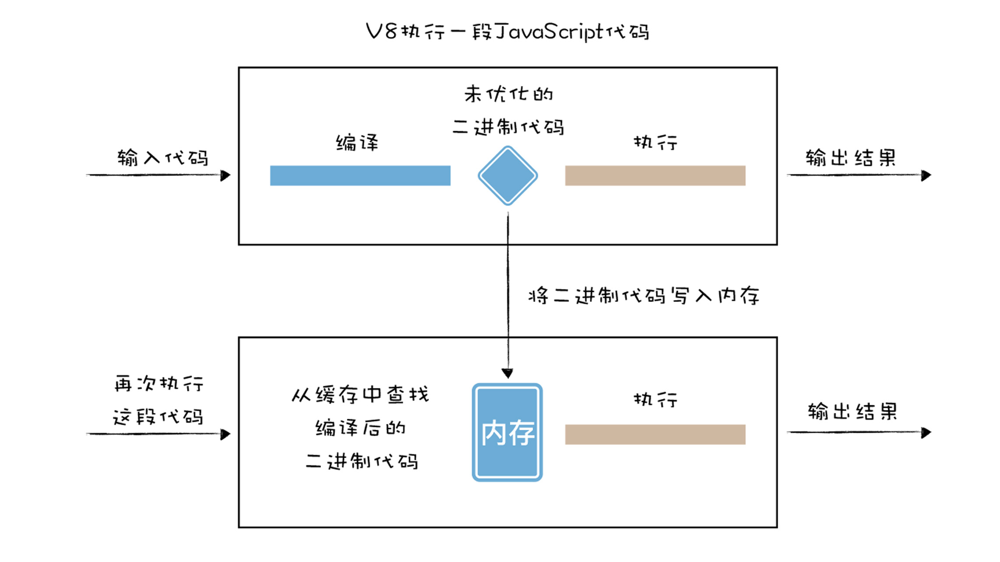
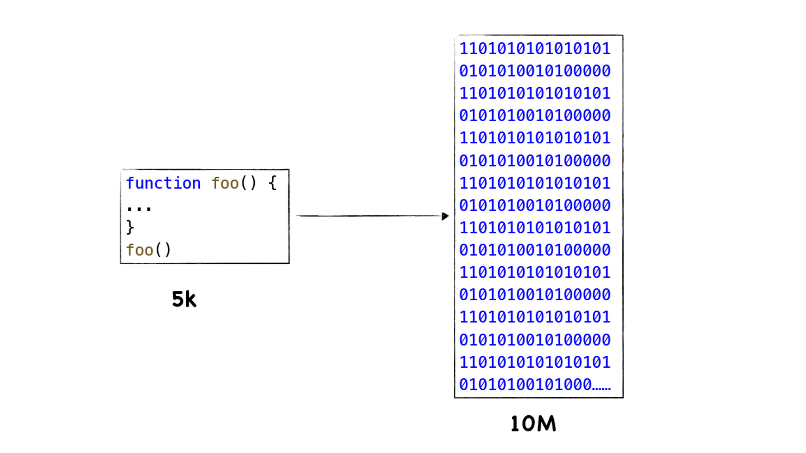
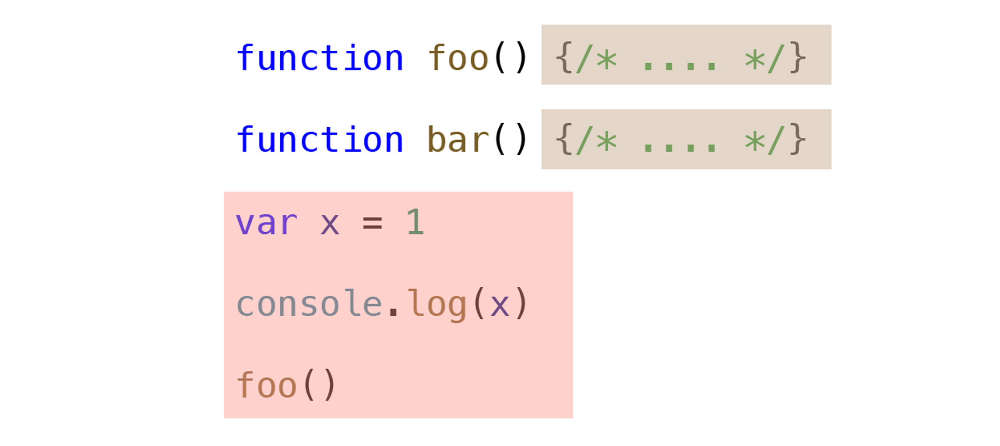
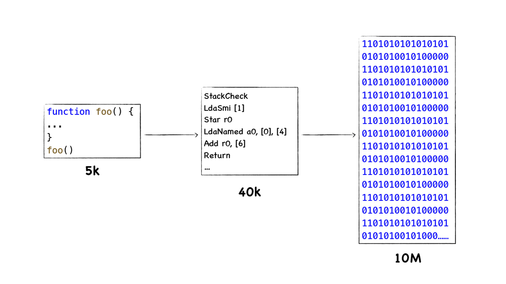
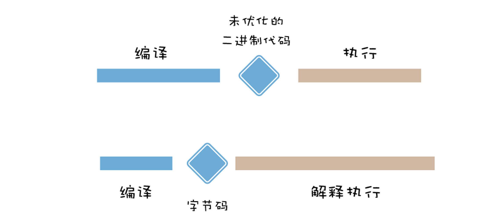
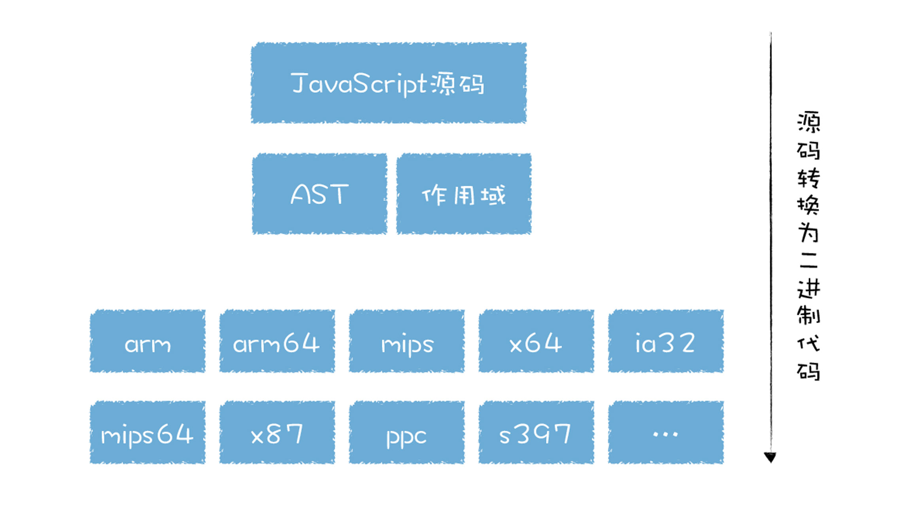
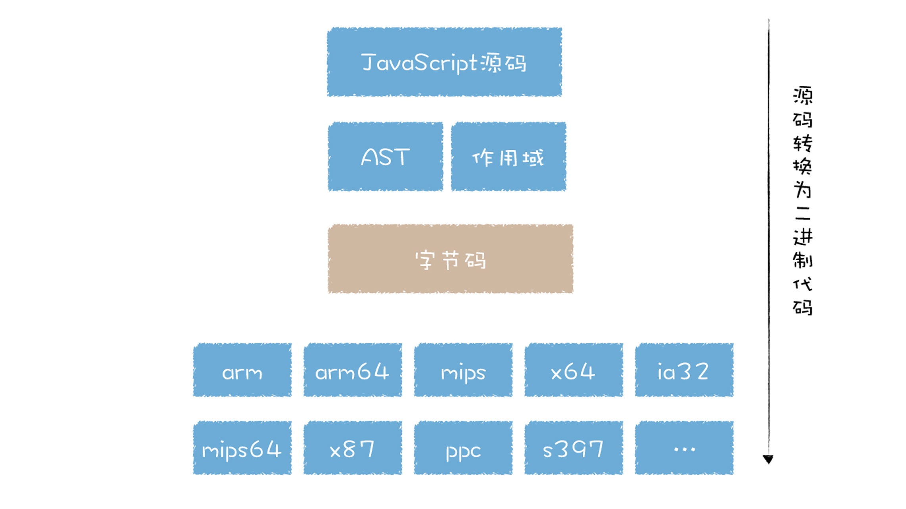

在第一节课我们就介绍了 V8 的编译流水线，我们知道 V8 在执行一段 JavaScript 代码之前，需要将其编译为字节码，然后再解释执行字节码或者将字节码编译为二进制代码然后再执行。

所谓字节码，是指编译过程中的中间代码，你可以把字节码看成是机器代码的抽象，在 V8 中，字节码有两个作用：

- 第一个是解释器可以直接解释执行字节码 ;
- 第二个是优化编译器可以将字节码编译为二进制代码，然后再执行二进制机器代码。

虽然目前的架构使用了字节码，不过早期的 V8 并不是这样设计的，那时候 V8 团队认为这种“先生成字节码再执行字节码”的方式，多了个中间环节，多出来的中间环节会牺牲代码的执行速度。

于是在早期，V8 团队采取了非常激进的策略，直接将 JavaScript 代码编译成机器代码。其执行流程如下图所示：



观察上面的执行流程图，我们可以发现，早期的 V8 也使用了两个编译器：

1. 第一个是**基线编译器**，它负责将 JavaScript 代码编译为**没有优化**过的机器代码。
2. 第二个是**优化编译器**，它负责将一些热点代码（执行频繁的代码）**优化**为执行效率更高的机器代码。

了解这两个编译器之后，接下来我们再来看看早期的 V8 是怎么执行一段 JavaScript 代码的。

1. 首先，V8 会将一段 JavaScript 代码转换为抽象语法树 (AST)。
2. 接下来基线编译器会将抽象语法树编译为未优化过的机器代码，然后 V8 直接执行这些未优化过的机器代码。
3. 在执行未优化的二进制代码过程中，如果 V8 检测到某段代码重复执行的概率过高，那么 V8 会将该段代码标记为 HOT，标记为 HOT 的代码会被优化编译器优化成执行效率高的二进制代码，然后就执行该段优化过的二进制代码。
4. 不过如果优化过的二进制代码并不能满足当前代码的执行，这也就意味着优化失败，V8 则会执行反优化操作。

以上就是早期的 V8 执行一段 JavaScript 代码的流程，不过最近发布的 V8 已经抛弃了直接将 JavaScript 代码编译为二进制代码的方式，也抛弃了这两个编译器，进而使用了字节码 + 解释器 + 编译器方式，也就是我们在第一节课介绍的形式。

早期的 V8 之所以抛弃中间形式的代码，直接将 JavaScript 代码编译成机器代码，是因为机器代码的执行性能非常高效，但是最新版本却朝着执行性能相反的方向进化，那么这是出于什么原因呢？

## 机器代码缓存

当 JavaScript 代码在浏览器中被执行的时候，需要先被 V8 编译，早期的 V8 会将 JavaScript 编译成未经优化的二进制机器代码，然后再执行这些未优化的二进制代码，通常情况下，编译占用了很大一部分时间，下面是一段代码的编译和执行时间图：



从图中可以看出，编译所消耗的时间和执行所消耗的时间是差不多的，试想一下，如果在浏览器中再次打开相同的页面，当页面中的 JavaScript 文件没有被修改，那么再次编译之后的二进制代码也会保持不变， 这意味着编译这一步白白浪费了 CPU 资源，因为之前已经编译过一次了。

这就是 Chrome 浏览器引入二进制代码缓存的原因，通过把二进制代码保存在内存中来消除冗余的编译，重用它们完成后续的调用，这样就省去了再次编译的时间。

V8 使用两种代码缓存策略来缓存生成的代码。

- 首先，是 V8 第一次执行一段代码时，会编译源 JavaScript 代码，并将编译后的二进制代码缓存在内存中，我们把这种方式称为内存缓存（in-memory cache)。然后通过 JavaScript 源文件的字符串在内存中查找对应的编译后的二进制代码。这样当再次执行到这段代码时，V8 就可以直接去内存中查找是否编译过这段代码。如果内存缓存中存在这段代码所对应的二进制代码，那么就直接执行编译好的二进制代码。
- 其次，V8 除了采用将代码缓存在内存中策略之外，还会将代码缓存到硬盘上，这样即便关闭了浏览器，下次重新打开浏览器再次执行相同代码时，也可以直接重复使用编译好的二进制代码。



实践表明，在浏览器中采用了二进制代码缓存的方式，初始加载时分析和编译的时间缩短了 20%～ 40%。

## 字节码降低了内存占用

所以在早期，Chrome 做了两件事来提升 JavaScript 代码的执行速度：

- 第一，将运行时将二进制机器代码缓存在内存中；
- 第二，当浏览器退出时，缓存编译之后二进制代码到磁盘上。

很明显，采用缓存是一种典型的以空间换时间的策略，以牺牲存储空间来换取执行速度，我们知道 Chrome 的多进程架构已经非常吃内存了，而 Chrome 中每个页面进程都运行了一份 V8 实例，V8 在执行 JavaScript 代码的过程中，会将 JavaScript 代码转换为未经优化的二进制代码，你可以对照下图中的 JavaScript 代码和二进制代码的：



从上图我们可以看出，二进制代码所占用的内存空间是 JavaScript 代码的十几倍，通常一个页面的 JavaScript 几 M 大小，转换为二进制代码就变成几十 M 了，如果是 PC 应用，多占用一些内存，也不会太影响性能，但是在移动设备流行起来之后，V8 过度占用内存的问题就充分暴露出来了。因为通常一部手机的内存不会太大，如果过度占用内存，那么会导致 Web 应用的速度大大降低。

在上一节我们介绍过，V8 团队为了提升 V8 的启动速度，采用了惰性编译，其实惰性编译除了能提升 JavaScript 启动速度，还可以解决部分内存占用的问题。你可以先参看下面的代码：



根据惰性编译的原则，当 V8 首次执行上面这段代码的过程中，开始只是编译最外层的代码，那些函数内部的代码，如下图中的黄色的部分，会推迟到第一次调用时再编译。

为了解决缓存的二进制机器代码占用过多内存的问题，早期的 Chrome 并没有缓存函数内部的二进制代码，只是缓存了顶层次的二进制代码，比如上图中红色的区域。

但是这种方式却存在很大的不确定性，比如我们多人开发的项目，通常喜欢将自己的代码封装成模块，在 JavaScript 中，由于没有块级作用域（ES6 之前），所以我们习惯使用立即调用函数表达式 (IIFEs)，比如下面这样的代码：

- `**test_module.js**`

```js
var test_module = (function () {
  var count_;
  function init_() {
    count_ = 0;
  }
  function add_() {
    count_ = count_ + 1;
  }
  function show_() {
    console.log(count_);
  }
  return {
    init: init_,
    add: add_,
    show: show_
  };
})();
```

- `app.js`

```js
test_module.init();
test_module.add();
test_module.show();
test_module.add();
test_module.show();
```

上面就是典型的闭包代码，它将和模块相关的所有信息都封装在一个匿名立即执行函数表达式中，并将需要暴漏的接口数据返回给变量 test_module。如果浏览器只缓存顶层代码，那么闭包模块中的代码将无法被缓存，而对于高度工程化的模块来说，这种模块式的处理方式到处都是，这就导致了一些关键代码没有办法被缓存。

所以采取只缓存顶层代码的方式是不完美的，没办法适应多种不同的情况，因此，V8 团队对早期的 V8 架构进行了非常大的重构，具体地讲，抛弃之前的基线编译器和优化编译器，引入了字节码、解释器和新的优化编译器。

那么为什么通过引入字节码就能降低 V8 在执行时的内存占用呢？要解释这个问题，我们不妨看下面这张图：



从图中可以看出，字节码虽然占用的空间比原始的 JavaScript 多，但是相较于机器代码，字节码还是小了太多。

有了字节码，无论是解释器的解释执行，还是优化编译器的编译执行，都可以直接针对字节来进行操作。由于字节码占用的空间远小于二进制代码，所以浏览器就可以实现缓存所有的字节码，而不是仅仅缓存顶层的字节码。

虽然采用字节码在执行速度上稍慢于机器代码，但是整体上权衡利弊，采用字节码也许是最优解。之所以说是最优解，是因为采用字节码除了降低内存之外，还提升了代码的启动速度，并降低了代码的复杂度，而牺牲的仅仅是一点执行效率。接下来我们继续来分析下，采用字节码是怎么提升代码启动速度和降低复杂度的。

## 字节码如何提升代码启动速度？

我们先看引入字节码是怎么提升代码启动速度的。下面是启动 JavaScript 代码的流程图：



从图中可以看出，生成机器代码比生成字节码需要花费更久的时间，但是直接执行机器代码却比解释执行字节码要更高效，所以在快速启动 JavaScript 代码与花费更多时间获得最优运行性能的代码之间，我们需要找到一个平衡点。

解释器可以快速生成字节码，但字节码通常效率不高。 相比之下，优化编译器虽然需要更长的时间进行处理，但最终会产生更高效的机器码，这正是 V8 在使用的模型。它的解释器叫 Ignition，（就原始字节码执行速度而言）是所有引擎中最快的解释器。V8 的优化编译器名为 TurboFan，最终由它生成高度优化的机器码。

## 字节码如何降低代码的复杂度？

早期的 V8 代码，无论是基线编译器还是优化编译器，它们都是基于 AST 抽象语法树来将代码转换为机器码的，我们知道，不同架构的机器码是不一样的，而市面上存在不同架构的处理器又是非常之多，你可以参看下图：



意味着基线编译器和优化编译器要针对不同的体系的 CPU 编写不同的代码，这会大大增加代码量。

引入了字节码，就可以统一将字节码转换为不同平台的二进制代码，你可以对比下执行流程：



因为字节码的执行过程和 CPU 执行二进制代码的过程类似，相似的执行流程，那么将字节码转换为不同架构的二进制代码的工作量也会大大降低，这就降低了转换底层代码的工作量。

## 总结

这节课我们介绍了 V8 为什么要引入字节码。早期的 V8 为了提升代码的执行速度，直接将 JavaScript 源代码编译成了没有优化的二进制的机器代码，如果某一段二进制代码执行频率过高，那么 V8 会将其标记为热点代码，热点代码会被优化编译器优化，优化后的机器代码执行效率更高。

不过随着移动设备的普及，V8 团队逐渐发现将 JavaScript 源码直接编译成二进制代码存在两个致命的问题：

- 时间问题：编译时间过久，影响代码启动速度；
- 空间问题：缓存编译后的二进制代码占用更多的内存。

这两个问题无疑会阻碍 V8 在移动设备上的普及，于是 V8 团队大规模重构代码，引入了中间的字节码。字节码的优势有如下三点：

- 解决启动问题：生成字节码的时间很短；
- 解决空间问题：字节码占用内存不多，缓存字节码会大大降低内存的使用；
- 代码架构清晰：采用字节码，可以简化程序的复杂度，使得 V8 移植到不同的 CPU 架构平台更加容易。

## 思考题

今天留给你一个开放的思考题：你认为 V8 虚拟机中的机器代码和字节码有哪些异同？欢迎你在留言区与我分享讨论。

```bash
答：字节码是平台无关的，机器码针对不同的平台都是不一样的
字节码是由V8虚拟机解释执行，是模拟物理CPU的执行过程
机器码是直接在物理CPU上执行，速度更快。
```
