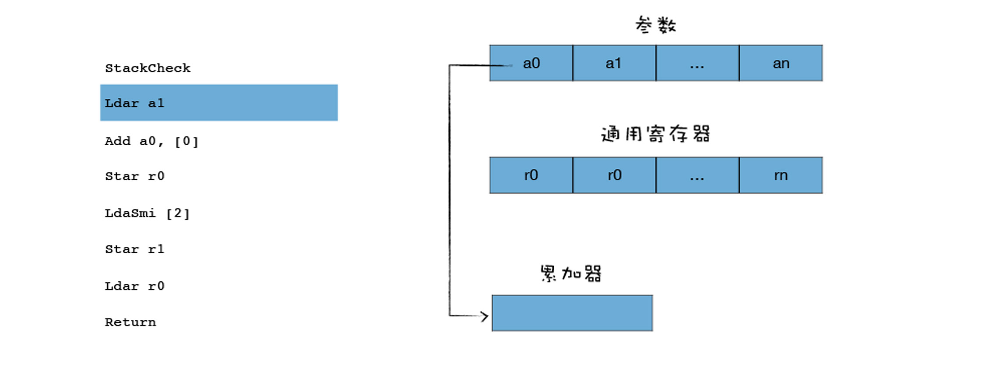

在上节我们介绍了 V8 为什么要引入字节码，这节课我们来聊聊解释器是如何解释执行字节码的。学习字节码如何被执行，可以让我们理解解释器的工作机制，同时还能帮助我们搞懂 JavaScript 运行时的内存结构，特别是闭包的结构和非闭包数据的区别。

字节码的解释执行在编译流水线中的位置你可以参看下图：


## 如何生成字节码？

我们知道当 V8 执行一段 JavaScript 代码时，会先对 JavaScript 代码进行解析 (Parser)，并生成为 AST 和作用域信息，之后 AST 和作用域信息被输入到一个称为 Ignition 的解释器中，并将其转化为字节码，之后字节码再由 Ignition 解释器来解释执行。

接下来，我们就结合一段代码来看看执行解释器是怎么解释执行字节码的。你可以参看下面这段代码：

```js
function add(x, y) {
  var z = x + y;
  return z;
}
console.log(add(1, 2));
```

在控制台执行这段代码，会返回数字 3，V8 是如何得到这个结果的呢？

刚刚我们提到了，V8 首先会将函数的源码解析为 AST，这一步由解析器 (Parser) 完成，你可以在 d8 中通过–print-ast 命令来查看 V8 内部生成的 AST。

```bash
[generating bytecode for function: add]
--- AST ---
FUNC at 12
. KIND 0
. LITERAL ID 1
. SUSPEND COUNT 0
. NAME "add"
. PARAMS
. . VAR (0x7fa7bf8048e8) (mode = VAR, assigned = false) "x"
. . VAR (0x7fa7bf804990) (mode = VAR, assigned = false) "y"
. DECLS
. . VARIABLE (0x7fa7bf8048e8) (mode = VAR, assigned = false) "x"
. . VARIABLE (0x7fa7bf804990) (mode = VAR, assigned = false) "y"
. . VARIABLE (0x7fa7bf804a38) (mode = VAR, assigned = false) "z"
. BLOCK NOCOMPLETIONS at -1
. . EXPRESSION STATEMENT at 31
. . . INIT at 31
. . . . VAR PROXY local[0] (0x7fa7bf804a38) (mode = VAR, assigned = false) "z"
. . . . ADD at 32
. . . . . VAR PROXY parameter[0] (0x7fa7bf8048e8) (mode = VAR, assigned = false) "x"
. . . . . VAR PROXY parameter[1] (0x7fa7bf804990) (mode = VAR, assigned = false) "y"
. RETURN at 37
. . VAR PROXY local[0] (0x7fa7bf804a38) (mode = VAR, assigned = false) "z"
```

同样，我们将其图形化：


从图中可以看出，函数的字面量被解析为 AST 树的形态，这个函数主要拆分成四部分。

- 第一部分为参数的声明 (PARAMS)，参数声明中包括了所有的参数，在这里主要是参数 x 和参数 y，你可以在函数体中使用 arguments 来使用对应的参数。
- 第二部分是变量声明节点 (DECLS)，参数部分你可以使用 arguments 来调用，同样，你也可以将这些参数作为变量来直接使用，这体现在 DECLS 节点下面也出现了变量 x 和变量 y，除了可以直接使用 x 和 y 之外，我们还有一个 z 变量也在 DECLS 节点下。你可以注意一下，在上面生成的 AST 数据中，参数声明节点中的 x 和变量声明节点中的 x 的地址是相同的，都是 0x7fa7bf8048e8，同样 y 也是相同的，都是 0x7fa7bf804990，这说明它们指向的是同一块数据。
- 第三部分是 x+y 的表达式节点，我们可以看到，节点 add 下面使用了 var proxy x 和 var proxy x 的语法，它们指向了实际 x 和 y 的值。
- 第四部分是 RETURN 节点，它指向了 z 的值，在这里是 local[0]。

V8 在生成 AST 的同时，还生成了 add 函数的作用域，你可以使用–print-scopes 命令来查看：

```bash

Global scope:
function add (x, y) { // (0x7f9ed7849468) (12, 47)
  // will be compiled
  // 1 stack slots
  // local vars:
  VAR y;  // (0x7f9ed7849790) parameter[1], never assigned
  VAR z;  // (0x7f9ed7849838) local[0], never assigned
  VAR x;  // (0x7f9ed78496e8) parameter[0], never assigned
}
```

作用域中的变量都是未使用的，默认值都是 undefined，在执行阶段，作用域中的变量会指向堆和栈中相应的数据，作用域和实际数据的关系如下图所示：


在解析期间，所有函数体中声明的变量和函数参数，都被放进作用域中，如果是普通变量，那么默认值是 undefined，如果是函数声明，那么将指向实际的函数对象。

一旦生成了作用域和 AST，V8 就可以依据它们来生成字节码了。AST 之后会被作为输入传到字节码生成器 (BytecodeGenerator)，这是 Ignition 解释器中的一部分，用于生成以函数为单位的字节码。你可以通过–print-bytecode 命令查看生成的字节码。

```bash

[generated bytecode for function: add (0x079e0824fdc1 <SharedFunctionInfo add>)]
Parameter count 3
Register count 2
Frame size 16
         0x79e0824ff7a @    0 : a7                StackCheck
         0x79e0824ff7b @    1 : 25 02             Ldar a1
         0x79e0824ff7d @    3 : 34 03 00          Add a0, [0]
         0x79e0824ff80 @    6 : 26 fb             Star r0
         0x79e0824ff82 @    8 : 0c 02             LdaSmi [2]
         0x79e0824ff84 @   10 : 26 fa             Star r1
         0x79e0824ff86 @   12 : 25 fb             Ldar r0
         0x79e0824ff88 @   14 : ab                Return
Constant pool (size = 0)
Handler Table (size = 0)
Source Position Table (size = 0)
```

我们可以看到，生成的字节码第一行提示了“Parameter count 3”，这是告诉我们这里有三个参数，包括了显式地传入了 x 和 y，还有一个隐式地传入了 this。下面是字节码的详细信息：

```bash

StackCheck
Ldar a1
Add a0, [0]
Star r0
LdaSmi [2]
Star r1
Ldar r0
Return
```

将 JavaScript 函数转换为字节码之后，我们看到只有 8 行，接下来我们的任务就是要分析这 8 行字节码是怎么工作的，理解了这 8 行字节码是怎么工作的，就可以学习其他字节码的工作方式了。

## 理解字节码：解释器的架构设计

通过上面的一段字节码我们可以看到，字节码似乎和汇编代码有点像，这些字节码看起来似乎难以理解，但实际上它们非常简单，每一行表示一个特定的功能，把这些功能拼凑在一起就构成完整的程序。

通俗地讲，你可以把这一行行字节码看成是一个个积木块，每个积木块块负责实现特定的功能，有实现运算的，有实现跳转的，有实现返回的，有实现内存读取的。一段 JavaScript 代码最终被 V8 还原成一个个积木块，将这些积木搭建在一起就实现了 JavaScript 的功能，现在我们大致了解了字节码就是一些基础的功能模块，接下来我们就来认识下这些构建块。

下图是一些常用的“积木块”，我们又称为字节码的指令集：


你也可以去 V8 的源码中查看这些字节码，V8 字节码的指令非常多，如果要掌握所有指令的含义，需要花费一段时间的学习和实践，这节课我们不需要了解所有字节码的含义，但我们需要知道，怎样阅读字节码。

我们阅读汇编代码，需要先理解 CPU 的体系架构，然后再分析特定汇编指令的具体含义，同样，要了解怎么阅读字节码，我们就需要理解 V8 解释器的整体设计架构，然后再来分析特定的字节码指令的含义。接下来，我们就依次介绍这两部分内容。

因为解释器就是模拟物理机器来执行字节码的，比如可以实现如取指令、解析指令、执行指令、存储数据等，所以解释器的执行架构和 CPU 处理机器代码的架构类似（关于 CPU 是如何执行机器代码的，你可以参看《10 ｜机器代码：二进制机器码究竟是如何被 CPU 执行的？》这节课）。

通常有两种类型的解释器，**基于栈 (Stack-based)\*\***和\***\*基于寄存器 (Register-based)**，基于栈的解释器使用栈来保存函数参数、中间运算结果、变量等，基于寄存器的虚拟机则支持寄存器的指令操作，使用寄存器来保存参数、中间计算结果。

通常，基于栈的虚拟机也定义了少量的寄存器，基于寄存器的虚拟机也有堆栈，其区别体现在它们提供的指令集体系。

大多数解释器都是基于栈的，比如 Java 虚拟机，.Net 虚拟机，还有早期的 V8 虚拟机。基于堆栈的虚拟机在处理函数调用、解决递归问题和切换上下文时简单明快。

而现在的 V8 虚拟机则采用了基于寄存器的设计，它将一些中间数据保存到寄存器中，了解这点对于我们分析字节码的执行过程非常重要。

接下来我们就来看看基于寄存器的解释器架构，具体你可以参考下图：


解释器执行时主要有四个模块，内存中的字节码、寄存器、栈、堆。

这和我们介绍过的 CPU 执行二进制机器代码的模式是类似的：

- 使用内存中的一块区域来存放字节码；
- 使用了通用寄存器 r0，r1，r2，…… 这些寄存器用来存放一些中间数据；
- PC 寄存器用来指向下一条要执行的字节码；
- 栈顶寄存器用来指向当前的栈顶的位置。

但是我们需要重点注意这里的**累加器**，它是一个非常特殊的寄存器，用来保存中间的结果，这体现在很多 V8 字节码的语义上面，我们来看下面这个字节码的指令：

```bash
Ldar a1
```

Ldar 表示将寄存器中的值加载到累加器中，你可以把它理解为 **LoaD Accumulator from Register**，就是把某个寄存器中的值，加载到累加器中。那么上面这个指令的意思就是把 a1 寄存器中的值，加载到累加器中，你可以参看下图：



我们再来看另外一个段字节码指令：

```bash
Star r0
```

Star 表示 Store Accumulator Register， 你可以把它理解为 Store Accumulator to Register，就是把累加器中的值保存到某个寄存器中，上面这段代码的意思就是将累加器中的数值保存到 r0 寄存器中，具体流程你可以参看下图：


我们再来看一个执行加法的字节码：

```bash
Add a0, [0]
```

Add a0, [0]是从 a0 寄存器加载值并将其与累加器中的值相加，然后将结果再次放入累加器，最终操作如下图所示：


你可能会注意到，add a0 后面还跟了一个[0]，这个符号是做什么的呢？

这个称之为 feedback vector slot，中文我们可以称为反馈向量槽，它是一个数组，解释器将解释执行过程中的一些数据类型的分析信息都保存在这个反馈向量槽中了，目的是为了给 TurboFan 优化编译器提供优化信息，很多字节码都会为反馈向量槽提供运行时信息，这块内容我们会在下一节来介绍。

在上面的字节码中，还有一个：

```bash
LdaSmi [2]
```

这是将小整数（Smi）2 加载到累加器寄存器中，操作流程你可以参看下图：


我们再来看一个字节码：

```bash
Return
```

Return 结束当前函数的执行，并将控制权传回给调用方。返回的值是累加器中的值。

好了，上面我们分析了几个常见的字节码的含义，相信你已经发现了，大部分字节码都间接地使用了累加器，认识到累加器在字节码指令中的使用方式之后，再去认识 V8 中的字节码就会非常轻松了。

## 完整分析一段字节码

接下来，我们完整地分析一段字节码是怎么执行的：

```bash

StackCheck
Ldar a1
Add a0, [0]
Star r0
LdaSmi [2]
Star r1
Ldar r0
Return
```

执行这段代码时，整体的状态如下图所示：


我们可以看到：

- 参数对象 parameter 保存在栈中，包含了 a0 和 a1 两个值，在上面的代码中，这两个值分别是 1 和 2；
- PC 寄存器指向了第一个字节码 StackCheck，我们知道，V8 在执行一个函数之前，会判断栈是否会溢出，这里的 StackCheck 字节码指令就是检查栈是否达到了溢出的上限，如果栈增长超过某个阈值，我们将中止该函数的执行并抛出一个 RangeError，表示栈已溢出。

然后继续执行下一条字节码，Ldar a1，这是将 a1 寄存器中的参数值加载到累加器中，这时候第一个参数就保存到累加器中了。

接下来执行加法操作，Add a0, [0]，因为 a0 是第一个寄存器，存放了第一个参数，Add a0 就是将第一个寄存器中的值和累加器中的值相加，也就是将累加器中的 2 和通用寄存器中 a0 中的 1 进行相加，同时将相加后的结果 3 保存到累加器中。

现在累加器中就保存了相加后的结果，然后执行第四段字节码，Star r0，这是将累加器中的值，也就是 1+2 的结果 3 保存到寄存器 r0 中，那么现在寄存器 r0 中的值就是 3 了。

然后将常数 2 加载到累加器中，又将累加器中的 2 加载到寄存器 r1 中，我们发现这里两段代码可能没实际的用途，不过 V8 生成的字节码就是这样。

接下来 V8 将寄存器 r0 中的值加载到累加器中，然后执行最后一句 Return 指令，Return 指令会中断当前函数的执行，并将累加器中的值作为返回值。

这样 V8 就执行完成了 add 函数。

## 总结

今天我们先分析了 V8 是如何生成字节码的，有了字节码，V8 的解释器就可以解释执行字节码了。通常有两种架构的解释器，基于栈的和基于寄存器的。基于栈的解释器会将一些中间数据存放到栈中，而基于寄存器的解释器会将一些中间数据存放到寄存器中。由于采用了不同的模式，所以字节码的指令形式是不同的。

而目前版本的 V8 是基于寄存器的，所以我们又重点分析了基于寄存器的解释器的架构，这些寄存器和 CPU 中的寄存器类似，不过这里有一个特别的寄存器，那就是累加器。在操作过程中，一些中间结果都默认放到累加器中，比如 Ldar a1 就是将第二个参数加载到累加器中，Star r0 是将累加器中的值写入到 r0 寄存器中，Return 就是返回累加器中的数值。

理解了累加器的重要性，我们又分析了一些常用字节码指令，这包括了 Ldar、Star、Add、LdaSmi、Return，了解了这些指令是怎么工作的之后，我们就可以完整地分析一段字节码的工作流程了。

## 思考题

观察下面这段代码：

```js
function foo() {
  var d = 20;
  return function inner(a, b) {
    const c = a + b + d;
    return c;
  };
}
const f = foo();
f(1, 2);
```

请你课后利用 d8 生成字节码，然后分析字节码的执行流程，欢迎你在留言区与我分享讨论。
