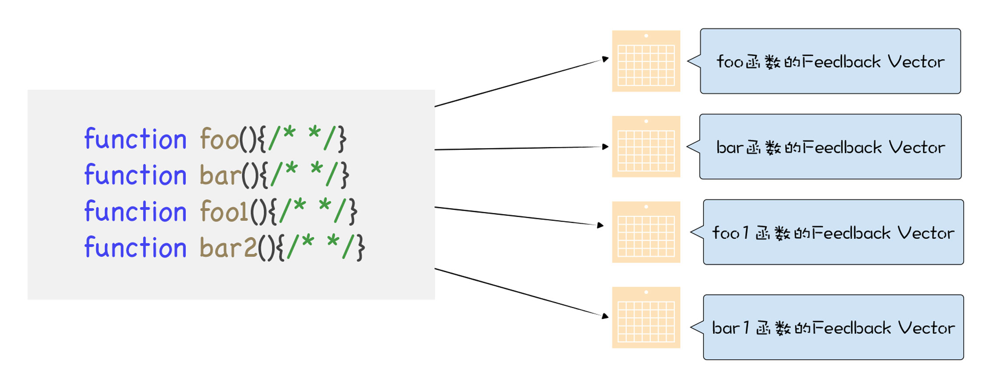
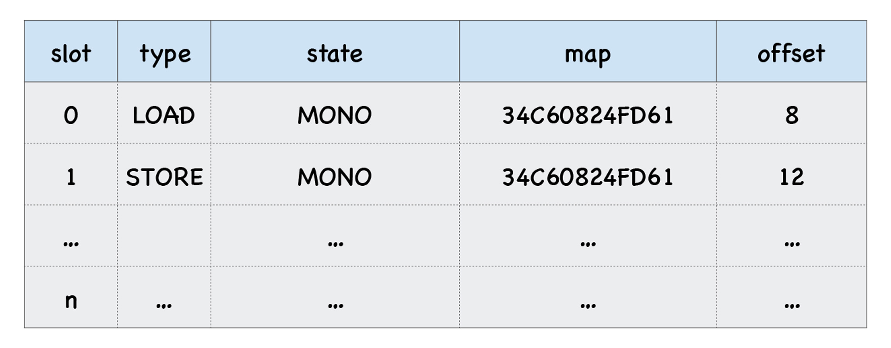
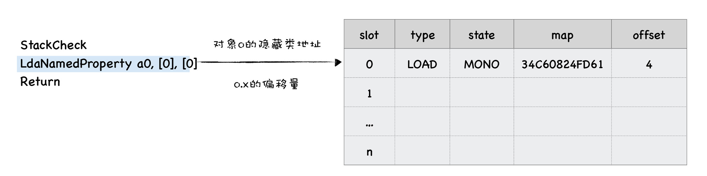
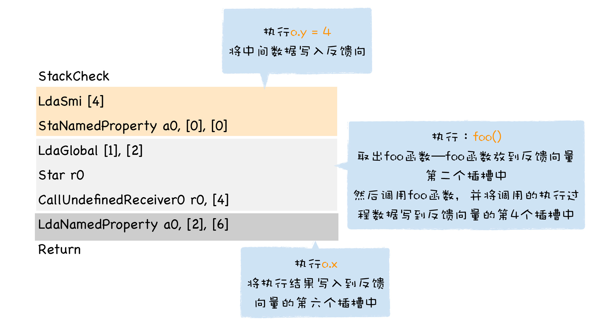
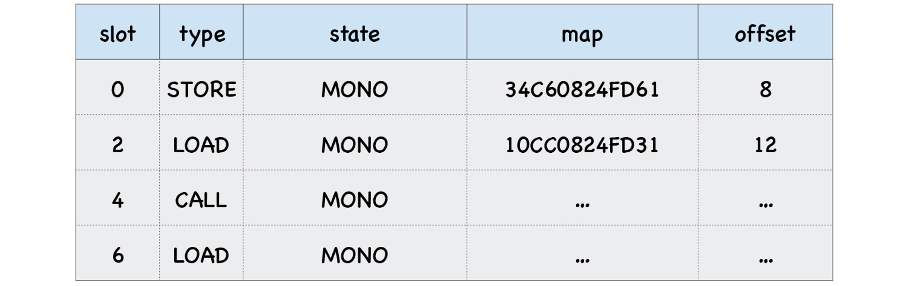
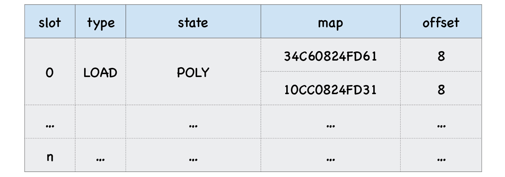

上节我们留了个思考题，提到了一段代码是这样的：

```js
function loadX(o) {
  return o.x;
}
var o = { x: 1, y: 3 };
var o1 = { x: 3, y: 6 };
for (var i = 0; i < 90000; i++) {
  loadX(o);
  loadX(o1);
}
```

我们定义了一个 loadX 函数，它有一个参数 o，该函数只是返回了 o.x。

通常 V8 获取 o.x 的流程是这样的：**查找对象 o 的隐藏类，再通过隐藏类查找 x 属性偏移量，然后根据偏移量获取属性值**，在这段代码中 loadX 函数会被反复执行，那么获取 o.x 流程也需要反复被执行。我们有没有办法再度简化这个查找过程，最好能一步到位查找到 x 的属性值呢？答案是，有的。

其实这是一个关于内联缓存的思考题。我们可以看到，函数 loadX 在一个 for 循环里面被重复执行了很多次，因此 V8 会想尽一切办法来压缩这个查找过程，以提升对象的查找效率。这个加速函数执行的策略就是**内联缓存 (Inline Cache)**，简称为 **IC。**

这节课我们就来解答下，V8 是怎么通过 IC，来加速函数 loadX 的执行效率的。

## 什么是内联缓存？

要回答这个问题，我们需要知道 IC 的工作原理。其实 IC 的原理很简单，直观地理解，就是在 V8 执行函数的过程中，会观察函数中一些**调用点 (CallSite) 上的关键的中间数据**，然后将这些数据缓存起来，当下次再次执行该函数的时候，V8 就可以直接利用这些中间数据，节省了再次获取这些数据的过程，因此 V8 利用 IC，可以有效提升一些重复代码的执行效率。

接下来，我们就深入分析一下这个过程。

IC 会为每个函数维护一个**反馈向量 (FeedBack Vector)**，反馈向量记录了函数在执行过程中的一些关键的中间数据。关于函数和反馈向量的关系你可以参看下图：



反馈向量其实就是一个表结构，它由很多项组成的，每一项称为一个**插槽 (Slot)**，V8 会依次将执行 loadX 函数的中间数据写入到反馈向量的插槽中。

比如下面这段函数：

```js
function loadX(o) {
  o.y = 4;
  return o.x;
}
```

当 V8 执行这段函数的时候，它会判断 o.y = 4 和 return o.x 这两段是**调用点 (CallSite)**，因为它们使用了对象和属性，那么 V8 会在 loadX 函数的反馈向量中为每个调用点分配一个插槽。

每个插槽中包括了插槽的索引 (slot index)、插槽的类型 (type)、插槽的状态 (state)、隐藏类 (map) 的地址、还有属性的偏移量，比如上面这个函数中的两个调用点都使用了对象 o，那么反馈向量两个插槽中的 map 属性也都是指向同一个隐藏类的，因此这两个插槽的 map 地址是一样的。



了解了反馈向量的大致结构，我们再来看下当 V8 执行 loadX 函数时，loadX 函数中的关键数据是如何被写入到反馈向量中。

loadX 的代码如下所示：

```js
function loadX(o) {
  return o.x;
}
loadX({ x: 1 });
```

我们将 loadX 转换为字节码：

```bash
StackCheck
LdaNamedProperty a0, [0], [0]
Return
```

loadX 函数的这段字节码很简单，就三句：

- 第一句是检查栈是否溢出；

- 第二句是 LdaNamedProperty，它的作用是取出参数 a0 的第一个属性值，并将属性值放到累加器中；

- 第三句是返回累加器中的属性值。

这里我们重点关注 LdaNamedProperty 这句字节码，我们看到它有三个参数。a0 就是 loadX 的第一个参数；第二个参数[0]表示取出对象 a0 的第一个属性值，这两个参数很好理解。第三个参数就和反馈向量有关了，它表示将 LdaNamedProperty 操作的中间数据写入到反馈向量中，方括号中间的 0 表示写入反馈向量的第一个插槽中。具体你可以参看下图：



观察上图，我们可以看出，在函数 loadX 的反馈向量中，已经缓存了数据：

- 在 map 栏，缓存了 o 的隐藏类的地址；
- 在 offset 一栏，缓存了属性 x 的偏移量；
- 在 type 一栏，缓存了操作类型，这里是 LOAD 类型。在反馈向量中，我们把这种通过 o.x 来访问对象属性值的操作称为 LOAD 类型。

V8 除了缓存 o.x 这种 LOAD 类型的操作以外，还会缓存**存储 (STORE) 类型**和**函数调用 (CALL) 类型**的中间数据。

为了分析后面两种存储形式，我们再来看下面这段代码：

```js
function foo() {}
function loadX(o) {
  o.y = 4;
  foo();
  return o.x;
}
loadX({ x: 1, y: 4 });
```

相应的字节码如下所示：

```bash
StackCheck
LdaSmi [4]
StaNamedProperty a0, [0], [0]
LdaGlobal [1], [2]
Star r0
CallUndefinedReceiver0 r0, [4]
LdaNamedProperty a0, [2], [6]
Return
```

下图是我画的这段字节码的执行流程：



从图中可以看出，o.y = 4 对应的字节码是：

```bash
LdaSmi [4]
StaNamedProperty a0, [0], [0]
```

这段代码是先使用 LdaSmi [4]，将常数 4 加载到累加器中，然后通过 StaNamedProperty 的字节码指令，将累加器中的 4 赋给 o.y，这是一个**存储 (STORE) 类型**的操作，V8 会将操作的中间结果存放到反馈向量中的第一个插槽中。

调用 foo 函数的字节码是：

```bash
LdaGlobal [1], [2]
Star r0
CallUndefinedReceiver0 r0, [4]
```

解释器首先加载 foo 函数对象的地址到累加器中，这是通过 LdaGlobal 来完成的，然后 V8 会将加载的中间结果存放到反馈向量的第 3 个插槽中，这是一个存储类型的操作。接下来执行 CallUndefinedReceiver0，来实现 foo 函数的调用，并将执行的中间结果放到反馈向量的第 5 个插槽中，这是一个**调用 (CALL) 类型**的操作。

最后就是返回 o.x，return o.x 仅仅是加载对象中的 x 属性，所以这是一个**加载 (LOAD) 类型**的操作，我们在上面介绍过的。最终生成的反馈向量如下图所示：



现在有了反馈向量缓存的数据，那 V8 是如何利用这些数据的呢？

当 V8 再次调用 loadX 函数时，比如执行到 loadX 函数中的 return o.x 语句时，它就会在对应的插槽中查找 x 属性的偏移量，之后 V8 就能直接去内存中获取 o.x 的属性值了。这样就大大提升了 V8 的执行效率。

## 多态和超态

好了，通过缓存执行过程中的基础信息，就能够提升下次执行函数时的效率，但是这有一个前提，那就是多次执行时，对象的形状是固定的，如果对象的形状不是固定的，那 V8 会怎么处理呢？

我们调整一下上面这段 loadX 函数的代码，调整后的代码如下所示：

```js
function loadX(o) {
  return o.x;
}
var o = { x: 1, y: 3 };
var o1 = { x: 3, y: 6, z: 4 };
for (var i = 0; i < 90000; i++) {
  loadX(o);
  loadX(o1);
}
```

我们可以看到，对象 o 和 o1 的形状是不同的，这意味着 V8 为它们创建的隐藏类也是不同的。

第一次执行时 loadX 时，V8 会将 o 的隐藏类记录在反馈向量中，并记录属性 x 的偏移量。那么当再次调用 loadX 函数时，V8 会取出反馈向量中记录的隐藏类，并和新的 o1 的隐藏类进行比较，发现不是一个隐藏类，那么此时 V8 就无法使用反馈向量中记录的偏移量信息了。

面对这种情况，V8 会选择将新的隐藏类也记录在反馈向量中，同时记录属性值的偏移量，这时，反馈向量中的第一个槽里就包含了两个隐藏类和偏移量。具体你可以参看下图：



当 V8 再次执行 loadX 函数中的 o.x 语句时，同样会查找反馈向量表，发现第一个槽中记录了两个隐藏类。这时，V8 需要额外做一件事，那就是拿这个新的隐藏类和第一个插槽中的两个隐藏类来一一比较，如果新的隐藏类和第一个插槽中某个隐藏类相同，那么就使用该命中的隐藏类的偏移量。如果没有相同的呢？同样将新的信息添加到反馈向量的第一个插槽中。

现在我们知道了，一个反馈向量的一个插槽中可以包含多个隐藏类的信息，那么：

- 如果一个插槽中只包含 1 个隐藏类，那么我们称这种状态为**单态 (monomorphic)；**

- 如果一个插槽中包含了 2 ～ 4 个隐藏类，那我们称这种状态为**多态 (polymorphic)；**

- 如果一个插槽中超过 4 个隐藏类，那我们称这种状态为**超态 (magamorphic)。**

如果函数 loadX 的反馈向量中存在多态或者超态的情况，其执行效率肯定要低于单态的，比如当执行到 o.x 的时候，V8 会查询反馈向量的第一个插槽，发现里面有多个 map 的记录，那么 V8 就需要取出 o 的隐藏类，来和插槽中记录的隐藏类一一比较，如果记录的隐藏类越多，那么比较的次数也就越多，这就意味着执行效率越低。

比如插槽中包含了 2 ～ 4 个隐藏类，那么可以使用线性结构来存储，如果超过 4 个，那么 V8 会采取 hash 表的结构来存储，这无疑会拖慢执行效率。单态、多态、超态等三种情况的执行性能如下图所示：


## 尽量保持单态

这就是 IC 的一些基础情况，非常简单，只是为每个函数添加了一个缓存，当第一次执行该函数时，V8 会将函数中的存储、加载和调用相关的中间结果保存到反馈向量中。当再次执行时，V8 就要去反馈向量中查找相关中间信息，如果命中了，那么就直接使用中间信息。

了解了 IC 的基础执行原理，我们就能理解一些最佳实践背后的道理，这样你并不需要去刻意记住这些最佳实践了，因为你已经从内部理解了它。

总的来说，我们只需要记住一条就足够了，那就是**单态的性能优于多态和超态，**所以我们需要稍微避免多态和超态的情况。

要避免多态和超态，那么就尽量默认所有的对象属性是不变的，比如你写了一个 loadX(o) 的函数，那么当传递参数时，尽量不要使用多个不同形状的 o 对象。

## 总结

这节课我们通过分析 IC 的工作原理，来介绍了它是如何提升代码执行速度的。

虽然隐藏类能够加速查找对象的速度，但是在 V8 查找对象属性值的过程中，依然有查找对象的隐藏类和根据隐藏类来查找对象属性值的过程。

如果一个函数中利用了对象的属性，并且这个函数会被多次执行，那么 V8 就会考虑，怎么将这个查找过程再度简化，最好能将属性的查找过程能一步到位。

因此，V8 引入了 IC，IC 会监听每个函数的执行过程，并在一些关键的地方埋下监听点，这些包括了加载对象属性 (Load)、给对象属性赋值 (Store)、还有函数调用 (Call)，V8 会将监听到的数据写入一个称为**反馈向量 (FeedBack Vector)** 的结构中，同时 V8 会为每个执行的函数维护一个反馈向量。有了反馈向量缓存的临时数据，V8 就可以缩短对象属性的查找路径，从而提升执行效率。

但是针对函数中的同一段代码，如果对象的隐藏类是不同的，那么反馈向量也会记录这些不同的隐藏类，这就出现了多态和超态的情况。我们在实际项目中，要尽量避免出现多态或者超态的情况。

最后我还想强调一点，虽然我们分析的隐藏类和 IC 能提升代码的执行速度，但是在实际的项目中，影响执行性能的因素非常多，**找出那些影响性能瓶颈才是至关重要**的，**你不需要过度关注微优化，你也不需要过度担忧你的代码是否破坏了隐藏类或者 IC 的机制**，因为相对于其他的性能瓶颈，它们对效率的影响可能是微不足道的。

## 思考题

观察下面两段代码：

```js
let data = [1, 2, 3, 4]
data.forEach((item) => console.log(item.toString())
```

```js
let data = ['1', 2, '3', 4]
data.forEach((item) => console.log(item.toString())
```

你认为这两段代码，哪段的执行效率高，为什么？欢迎你在留言区与我分享讨论。
