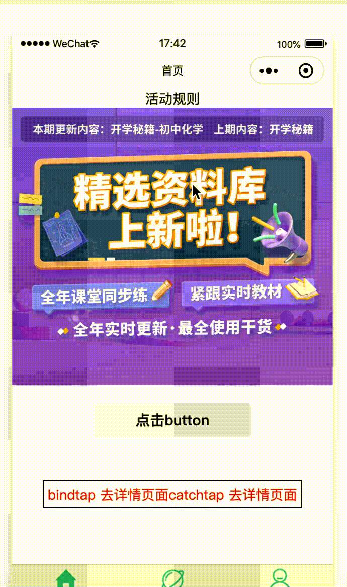

# 自定义组件

## 组件模板和样式

### 组件模板

自定义组件类似于页面

```bash
.
└── popup
    ├── index.js
    ├── index.json
    ├── index.wxml
    └── index.wxss
```

代码样式：

```json
<!--src/components/popup/index.json-->
{
  "component": true,
  "usingComponents": {}
}
```

```bash
<!--src/components/popup/index.wxml-->
<view hidden="{{isHidden}}">
  <view class="popup-inner">
    <view>{{ innerText }}</view>
    <slot name="body" bind:close-mask="hideModal"></slot>
    <view class="close">
      <image catchtap="hideModal" src="close.png" mode="widthFix"></image>
    </view>
  </view>
  <view class="mask"></view>
</view>

/* src/components/popup/index.wxss */
:host {
  color: yellow;
}

.popup-inner {
  position: fixed;
  width: 90%;
  z-index: 1020;
  top: 50%;
  left: 50%;
  transform: translate(-50%, -50%);
  border-radius: 15rpx;
}

.close {
  display: block;
  width: 60rpx;
  height: 60rpx;
  margin: 100rpx auto 0;
}

.close image {
  width: 100%;
  height: 100%;
}

.mask {
  position: fixed;
  top: 0;
  left: 0;
  width: 100%;
  height: 100%;
  background: rgba(0, 0, 0, .7);
  z-index: 100;
}

/* src/components/popup/index.js */
Component({
  options: {
    multipleSlots: true // 在组件定义时的选项中启用多slot支持
  },
  // 组件传值
  properties: {
    // 这里定义了innerText属性，属性值可以在组件使用时指定
    innerText: {
      type: String,
      value: '默认值'
    }
  },
  // 私有属性
  data: {
    isHidden: true
  },
  // 组件数据字段监听器，用于监听 properties 和 data 的变化
  observers: {
    isHidden: function (isHidden) {
      this.triggerEvent('close-modal', { isHidden: isHidden })
    }
  },
  methods: {
    showModal() {
      this.setData({
        isHidden: false
      })
    },
    hideModal() {
      this.triggerEvent('closeMask', 'only close')
      this.setData({
        isHidden: true
      })
    }
  }
})

/* src/components/popup/index.json */
{
  "component": true,
  "usingComponents": {}
}
```

在父组件中使用该组件：

```bash
<!-- index.wxml -->
<component-popup inner-text="组件传值" catchtouchmove id="popup" bind:closeMask="closeMask">
  <view slot="body">插槽</view>
</component-popup>

//index.js
Page({
  // 展示弹框
  showRules () {
    setTimeout(() => {
      this.setPopupStatus({el:'#popup', hidden: false })
    }, 150)
  },
  setPopupStatus({ el, hidden }) {
    let childDialog = this.selectComponent(el)
    childDialog.setData({
      isHidden: hidden
    })
  },
  // 点击X号关闭弹窗
  closeMask (e) {
    console.log('关闭登录弹窗')
    wx.showTabBar()
    this.setData({ showFreeTip: true })
  },
})

// .json
{
  "usingComponents": {
    "component-popup": "../../compontents/popup/index"
  }
}

```

效果：



### 模板数据绑定

`{{}}`语法

### 组件 wxml 的 slot

slot插槽 —— 用于承载组件使用者提供的 wxml 结构

### 组件样式

```css
#a { } /* 在组件中不能使用 */
[a] { } /* 在组件中不能使用 */
button { } /* 在组件中不能使用 */
.a > .b { } /* 除非 .a 是 view 组件节点，否则不一定会生效 */
/* 小程序自定义组件全局样式类 */
:host {
  color: yellow;
}
```

### 组件样式隔离

防止`app.wxss`样式影响

```js
Component({
  options: {
    styleIsolation: 'isolated'
  }
})
```

### 外部样式类

组件希望接受外部传入的样式类

```js
/* 组件 custom-component.js */
Component({
  externalClasses: ['my-class']
})
```

```html
<!-- 组件 custom-component.wxml -->
<component class="my-class">这段文本的颜色由组件外的 class 决定</component>
```

### 引用页面或父组件的样式

即使启用了样式隔离 isolated ，组件仍然可以在局部引用组件所在页面的样式或父组件的样式。

```html
<view class="~blue-text"> 这段文本是蓝色的 </view>

/* 在父页面wxss定义类
.blue-text {
  color: blue;
}
*/
```

### 虚拟化组件节点

自定义组件并不希望这个节点本身可以设置样式、响应 flex 布局等，
而是希望自定义组件内部的第一层节点能够响应 flex 布局或者样式由自定义组件本身完全决定。

```js
Component({
  options: {
    virtualHost: true
  },
  properties: {
    style: { // 定义 style 属性可以拿到 style 属性上设置的值
      type: String,
    }
  },
  externalClass: ['class'], // 可以将 class 设为 externalClass
})
```

需要注意的是，自定义组件节点上的 class style 和动画将不再生效，但仍可以：

- 将 style 定义成 properties 属性来获取 style 上设置的值；
- 将 class 定义成 externalClasses 外部样式类使得自定义组件 wxml 可以使用 class 值

## Component 构造器

Component 构造器可用于定义组件，调用 Component 构造器时可以指定组件的属性、数据、方法等。

```js
// 执行顺序：lifetimes-attached => pageLifetimes-show => ready
var pageCommonBehavior = require('./page-common-behavior')
Component({
  behaviors: [pageCommonBehavior], // 可以为多个页面写入公共的js代码
  lifetimes: {
    // 生命周期函数，可以为函数，或一个在methods段中定义的方法名
    attached: function () {
      console.log('lifetimes-attached') // 1
    },
    moved: function () {
      console.log('lifetimes-moved')
    },
    ready: function () {
      console.log('ready') // 3
    },
    detached: function () {}
  },

  pageLifetimes: {
    // 组件所在页面的生命周期函数
    show: function () {
      console.log('pageLifetimes-show') // 2
    },
    hide: function () {
      console.log('pageLifetimes-hide')
    },
    resize: function () {
      console.log('pageLifetimes-resize')
    }
  }
})

```

## 组件间通信与事件

### 组件间通信

1. 属性绑定：WXML 数据绑定：用于父组件向子组件的指定属性设置数据；
2. 事件绑定：用于子组件向父组件传递数据，可以传递任意数据；
3. 父组件还可以通过 this.selectComponent 方法获取子组件实例对象。

### 触发事件

父组件可以监听子组件的事件，并接收子组件传递过来的值

1. 在子组件中`methods`定义事件；需要使用 `triggerEvent` 方法，指定事件名、detail对象和事件选项，用来传值数据；
2. 在引用是完成事件绑定；
3. 父组件定义事件来接收组件。

*和`vue`的事件绑定相似，但是小程序中需要使用`triggerEvent`来保证组件通信，而`vue`是通过`$emit` 实现*

### 获取组件实例

可在父组件里调用 this.selectComponent ，获取子组件的实例对象。调用时需要传入一个匹配选择器 selector，`this.selectComponent("#id")`

```js
const child = this.selectComponent('#popup')
console.log(child) // 相当于子组件的 this
```

### 组件生命周期

```js
Component({
  lifetimes: { // 定义生命周期方法
    // 生命周期函数，可以为函数，或一个在methods段中定义的方法名
    attached: function () {
      console.log('在组件实例进入页面节点树时执行')
    },
    moved: function () {
      console.log('lifetimes-moved')
    },
    ready: function () {
      console.log('ready')
    },
    detached: function () {
      console.log('在组件实例被从页面节点树移除时执行')
    }
  },
  pageLifetimes: { // 组件所在页面的生命周期
    show: function () {
      console.log('页面被展示')
    },
    hide: function () {
      console.log('页面被隐藏')
    },
    resize: function () {
      console.log('页面尺寸变化')
    }
  }
})
```

## behaviors

相当于`maxins`

## 组件间关系

[组件间关系](https://developers.weixin.qq.com/miniprogram/dev/framework/custom-component/relations.html)

## 数据监听器

相当于`vue`的`watch`，但是支持同时监听多个，以及通配符监听

[详见官方文档](https://developers.weixin.qq.com/miniprogram/dev/framework/custom-component/observer.html)

## 纯数据字段

纯数据字段是一些不用于界面渲染的 data 字段，可以用于提升页面更新性能。，相当于`vue`的`computed`。

[纯数据字段](https://developers.weixin.qq.com/miniprogram/dev/framework/custom-component/pure-data.html)

*抽象节点，自定义组件扩展，开发第三方自定义组件，单元测试 详见官方文档。*
