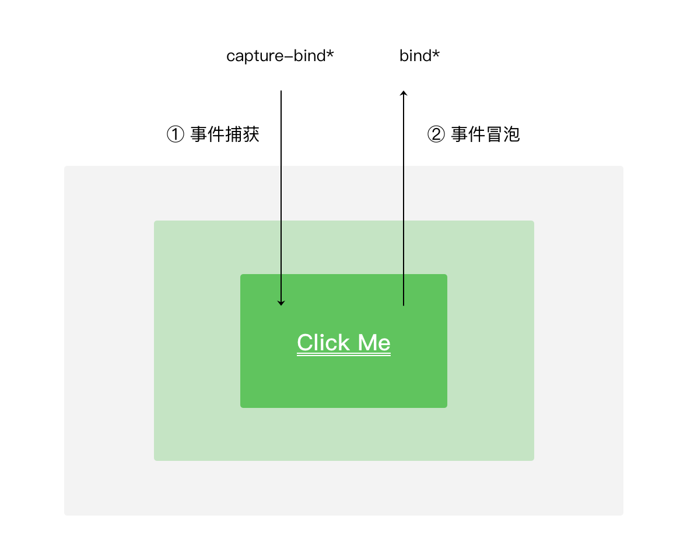
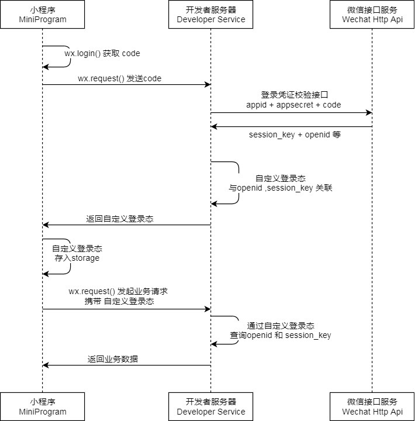
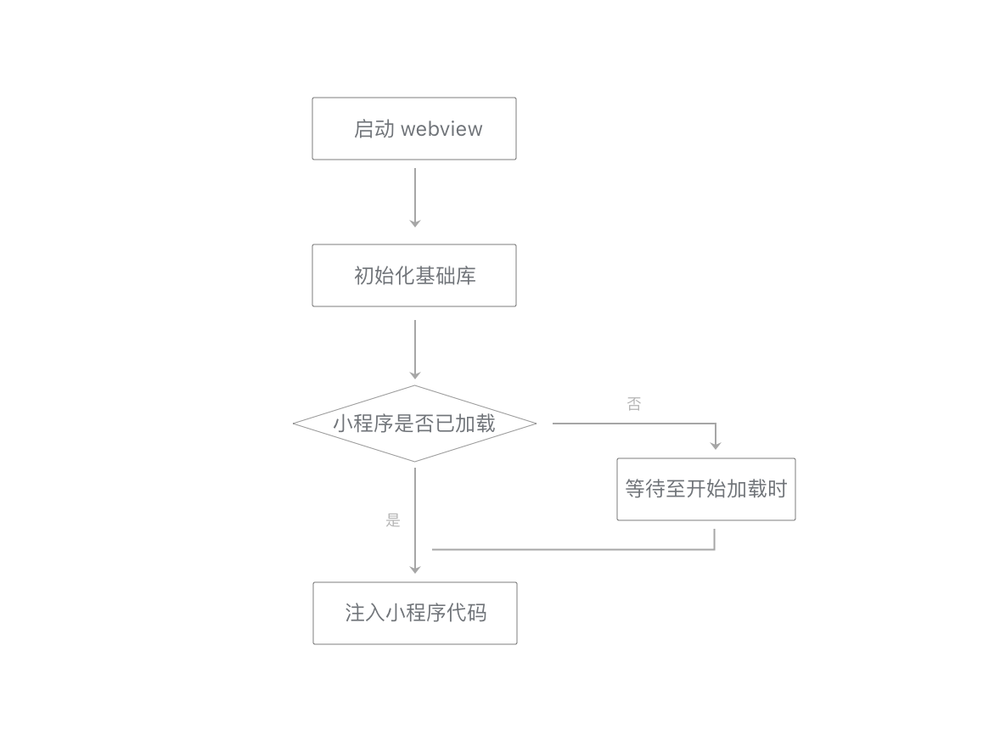
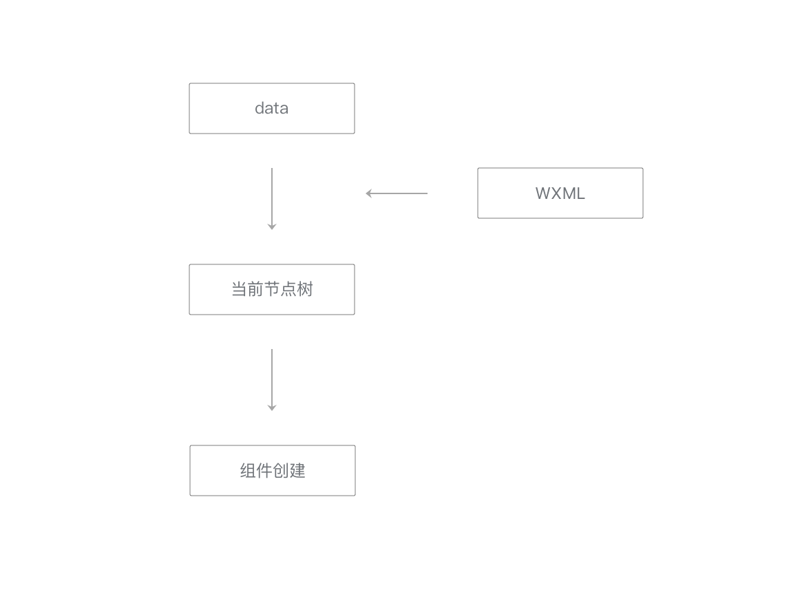
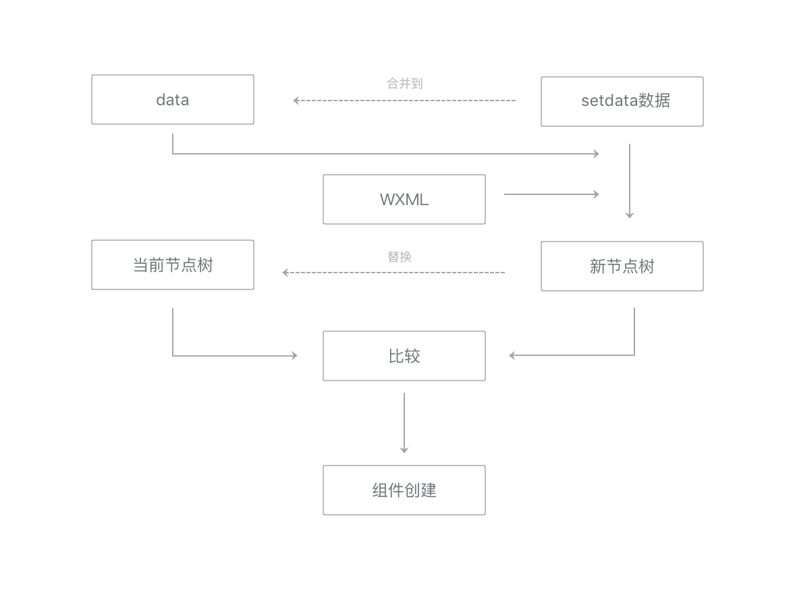
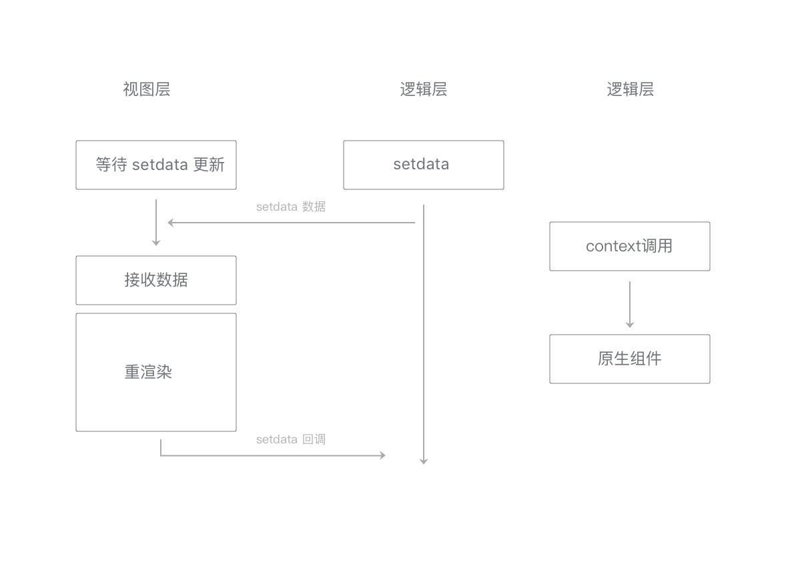

- [微信官方文档](https://developers.weixin.qq.com/miniprogram/dev/framework/quickstart/)

## 第1章 小程序介绍与开发环境

参看官方文档：[小程序介绍与开发环境](https://developers.weixin.qq.com/ebook?action=get_post_info&docid=0008aeea9a8978ab0086a685851c0a)

## 第2章 小程序代码组成

### 2.1 JSON 配置

项目的根目录 `app.json`：**`app.json` 是当前小程序的全局配置，包括了小程序的所有页面路径、界面表现、网络超时时间、底部 `tab` 等。**

项目的根目录 `project.config.json`：**工具配置，相当于VSCode的`.vscode/setting.json`文件**

`pages/logs` 目录下还有一个 `logs.json`：**独立定义每个页面的一些属性**

### 2.2 WXML模板、WXSS样式

WXML模板：形如`vue`的双花括号语法

WXSS样式：CSS常用选择器

### 2.3 JS逻辑交互

[JavaScript 脚本](https://developers.weixin.qq.com/ebook?action=get_post_info&docid=000a8806958588cb00862bd5851c0a)

| 浏览器中的 JavaScript | NodeJS中的 JavaScript | 小程序中的 JavaScript |
| --------------------- | --------------------- | --------------------- |
| ECMAScript            | ECMAScript            | ECMAScript            |
| DOM                   | NPM                   | 小程序框架            |
| BOM                   | Native                | 小程序 API            |

JS逻辑交互：形如`react`的状态更新和生命周期

## 第3章 理解小程序宿主环境

### 3.1 渲染层和逻辑层

小程序的运行环境分成渲染层和逻辑层：

- WXML 模板和 WXSS 样式工作在渲染层
- JS 脚本工作在逻辑层

小程序的渲染层和逻辑层分别由2个线程管理：渲染层的界面使用了 `WebView` 进行渲染；逻辑层采用 `JsCore` 线程运行JS脚本。一个小程序存在多个界面（多个 `WebView` ），所以渲染层存在多个 `WebView` 线程，这两个线程的通信会经由微信客户端（下文中也会采用 `Native` 来代指微信客户端）做中转，逻辑层发送网络请求也经由 `Native` 转发，小程序的通信模型下图所示。

通信模型：


数据驱动：

`vue + react`

双线程下的界面渲染：


### 3.2 程序和页面

**程序**：宿主环境提供了**程序构造器App()**来注册一个程序App：

- App() 构造器必须写在项目根目录的app.js里
- App实例是单例对象
- 在其他JS脚本中可以使用宿主环境提供的 getApp() 来获取程序实例

```js
// App构造器接受一个Object参数
App({
  onLaunch: function(options) {},
  onShow: function(options) {},
  onHide: function() {},
  onError: function(msg) {},
  globalData: 'I am global data' // 自定义全局数据
})

```

**页面**：一个页面是分三部分组成：界面、配置和逻辑：

- 界面由WXML文件和WXSS文件来负责描述
- 配置由JSON文件进行描述，页面逻辑则是由JS脚本文件负责
- 一个页面的文件需要放置在同一个目录下，其中WXML文件和JS文件是必须存在的
- JSON和WXSS文件是可选的

*注意：页面路径需要在根目录app.json中的pages字段声明。*

页面构造器由**Page() 构造器**生成，Page()在页面脚本page.js中调用：

```js
Page({
  data: { text: "This is page data." },
  onLoad: function(options) { },
  onReady: function() { }, // onReady在页面没被销毁前只会触发1次，onReady触发时，表示页面已经准备妥当，在逻辑层就可以和视图层进行交互了。
  onShow: function() { },
  onHide: function() { },
  onUnload: function() { },
  onPullDownRefresh: function() { }, // 监听用户下拉动作
  onReachBottom: function() { }, // 页面上拉触底事件的处理函数
  onShareAppMessage: function () { }, // 用户点击右上角转发
  onPageScroll: function() { } // 页面滚动触发事件的处理函数
})
```

以上三个事件触发的时机是onLoad早于 onShow，onShow早于onReady。

**页面跳转和路由：**

`wx.navigateTo()`不会销毁页面，而是在页面栈中增加 detail 页

`wx.redirectTo`或`wx.navigateBack`返回到其他页时，当前页面会被微信客户端销毁回收，此时Page构造器参数所定义的onUnload方法会被调用。

`wx.navigateTo`和`wx.redirectTo`只能打开非`TabBar`页面，`wx.switchTab`只能打开Tabbar页面，**原来的页面栈会被清空（除了已经声明为Tabbar页pageA外其他页面会被销毁）**

我们还可以使用 `wx.reLaunch()` 重启小程序

### 3.3 组件

```html
<image mode="scaleToFill" src="img.png"></image>

<view>这是一个view组件</view>
```

组件共有属性：

| 属性名         | 类型         | 描述           | 其他说明                                 |
| :------------- | :----------- | :------------- | :--------------------------------------- |
| id             | String       | 组件的唯一标示 | 保持整个页面唯一                         |
| class          | String       | 组件的样式类   | 在对应的WXSS中定义的样式类               |
| style          | String       | 组件的内联样式 | 可以通过数据绑定进行动态设置的内联样式   |
| hidden         | Boolean      | 组件是否显示   | 所有组件默认显示                         |
| data-*         | Any          | 自定义属性     | 组件上触发的事件时，会发送给事件处理函数 |
| bind */ catch* | EventHandler | 事件           | 详情见3.5节                              |

[所有组件的属性说明](https://developers.weixin.qq.com/miniprogram/dev/component/)

### 3.4 API

小程序提供的API按照功能主要分为几大类：网络、媒体、文件、数据缓存、位置、设备、界面、界面节点信息还有一些特殊的开放接口，我们介绍一下API一般调用的约定：

1. **wx.on 开头的 API 是监听某个事件发生的API接口，接受一个 Callback 函数作为参数。当该事件触发时，会调用 Callback 函数。***
2. 如未特殊约定，多数 API 接口为异步接口 ，都接受一个Object作为参数。
3. API的Object参数一般由success、fail、complete三个回调来接收接口调用结果。
4. wx.get* 开头的API是获取宿主环境数据的接口。
5. wx.set* 开头的API是写入数据到宿主环境的接口。

[官方API文档](https://developers.weixin.qq.com/miniprogram/dev/api/)

### 3.5 事件

```html
<!-- page.wxml -->
<view id="tapTest" data-hi="WeChat" bindtap="tapName"> Click me! </view>

// page.js
Page({
  tapName: function(event) {
    console.log(event)
  }
})
```


#### 3.5.1 事件类型和事件对象

[组件的事件可以参考其参数说明](https://mp.weixin.qq.com/debug/wxadoc/dev/component/)

| 类型               | 触发条件                                                     |
| :----------------- | :----------------------------------------------------------- |
| touchstart         | 手指触摸动作开始                                             |
| touchmove          | 手指触摸后移动                                               |
| touchcancel        | 手指触摸动作被打断，如来电提醒，弹窗                         |
| touchend           | 手指触摸动作结束                                             |
| tap                | 手指触摸后马上离开                                           |
| longpress          | 手指触摸后，超过350ms再离开，如果指定了事件回调函数并触发了这个事件，tap事件将不被触发 |
| longtap            | 手指触摸后，超过350ms再离开（推荐使用longpress事件代替）     |
| transitionend      | 会在 WXSS transition 或 wx.createAnimation 动画结束后触发    |
| animationstart     | 会在一个 WXSS animation 动画开始时触发                       |
| animationiteration | 会在一个 WXSS animation 一次迭代结束时触发                   |
| animationend       | 会在一个 WXSS animation 动画完成时触发                       |

当事件回调触发的时候，会收到一个事件对象，对象的详细属性如下表所示。

| 属性           | 类型    | 说明                                         |
| :------------- | :------ | :------------------------------------------- |
| type           | String  | 事件类型                                     |
| timeStamp      | Integer | 页面打开到触发事件所经过的毫秒数             |
| target         | Object  | 触发事件的组件的一些属性值集合               |
| currentTarget  | Object  | 当前组件的一些属性值集合                     |
| detail         | Object  | 额外的信息                                   |
| touches        | Array   | 触摸事件，当前停留在屏幕中的触摸点信息的数组 |
| changedTouches | Array   | 触摸事件，当前变化的触摸点信息的数组         |

这里需要注意的是target和currentTarget的区别，currentTarget为当前事件所绑定的组件，而target则是触发该事件的源头组件。

事件对象示例：

```html
<!-- page.wxml -->
<view id="outer" catchtap="handleTap">
  <view id="inner">点击我</view>
</view>
// page.js
Page({
  handleTap: function(evt) {
       // 当点击inner节点时
       // evt.target 是inner view组件
       // evt.currentTarget 是绑定了handleTap的outer view组件
       // evt.type == “tap”
       // evt.timeStamp == 1542
       // evt.detail == {x: 270, y: 63}
       // evt.touches == [{identifier: 0, pageX: 270, pageY: 63, clientX: 270, clientY: 63}]
       // evt.changedTouches == [{identifier: 0, pageX: 270, pageY: 63, clientX: 270, clientY: 63}]
  }
})
```

target和currentTarget对象的详细参数：

| 属性    | 类型   | 说明                                        |
| :------ | :----- | :------------------------------------------ |
| id      | String | 当前组件的id                                |
| tagName | String | 当前组件的类型                              |
| dataset | Object | 当前组件上由data-开头的自定义属性组成的集合 |

touch和changedTouches对象的详细参数：

| 属性             | 类型   | 说明                                                         |
| :--------------- | :----- | :----------------------------------------------------------- |
| identifier       | Number | 触摸点的标识符![事件绑定与冒泡捕获]                          |
| pageX, pageY     | Number | 距离文档左上角的距离，文档的左上角为原点 ，横向为X轴，纵向为Y轴 |
| clientX, clientY | Number | 距离页面可显示区域（屏幕除去导航条）左上角距离，横向为X轴，纵向为Y轴 |

#### 3.5.2 事件绑定与冒泡捕获

**事件绑定和`vue`事件（vue是@开头，小程序是bind、catch开头）绑定相似**：以bind或者catch开头，然后跟上事件的类型，如bindtap、catchtouchstart。自基础库版本1.5.0起，bind和catch后可以紧跟一个冒号，其含义不变，如bind:tap、catch:touchstart。同时bind和catch前还可以加上capture-来表示捕获阶段。

```html
<view bind:touchstart="handleTap1" capture-bind:touchstart="handleTap2" >事件绑定</view>
```

**bind事件绑定不会阻止冒泡事件向上冒泡，catch事件绑定可以阻止冒泡事件向上冒泡。**

**如`<form/>`的submit事件，`<input/>`的input事件，`<scroll-view/>`的scroll事件都是非冒泡事件，**



## 第四章 场景应用

### 4.1 基本的布局方法——Flex布局

[基本的布局方法——Flex布局](https://developers.weixin.qq.com/ebook?action=get_post_info&docid=00080e799303986b0086e605f5680a)

### 4.2 界面常见的交互反馈

**触摸反馈：**采用自定义`hover-class`属性，配合`.hover`类完成：

```html
<!-- index.wxml -->
<button hover-class="hover">点击button</button>
<view hover-class="hover">点击view</view>

<!-- index.wxss -->
.hover {
  background-color: red;
}
```

**Toast和模态对话框：**

```js
wx.showToast({
  // 显示Toast
  title: '已发送',
  icon: 'success',
  duration: 1500
})
// wx.hideToast() // 隐藏Toast

wx.showModal({
  title: '标题',
  content: '告知当前状态，信息和解决方法',
  confirmText: '主操作',
  cancelText: '次要操作',
  success: function (res) {
    if (res.confirm) {
      console.log('用户点击主操作')
    } else if (res.cancel) {
      console.log('用户点击次要操作')
    }
  }
})
```

**下来刷新：**

```json
// 在page.json 或 app.json 加入
"window":{
  "enablePullDownRefresh": true, // 打开下拉刷新
  "onReachBottomDistance": 200 // 下拉多少高度触发事件
},
```

```js
  onPullDownRefresh: function() {
    // 用户触发了下拉刷新操作
    // 拉取新数据重新渲染界面
    // wx.stopPullDownRefresh() // 可以停止当前页面的下拉刷新。
  }
```

**上拉触底：**

```json
// 在page.json 或 app.json 加入
"window":{
  "onReachBottomDistance": 100 // 界面的下方距离页面底部距离小于onReachBottomDistance像素时触发onReachBottom回调
},
```

```js
  onReachBottom: function() {
    // 当界面的下方距离页面底部距离小于100像素时触发回调
  }
```

**[发起HTTPS网络通信](https://developers.weixin.qq.com/ebook?action=get_post_info&docid=000ee27c9c8d98ab0086788fa5b00a)**

### 4.3 微信登录



**[本地数据缓存](https://developers.weixin.qq.com/ebook?action=get_post_info&docid=000a2c7c9f4a981b0086bd31e5b40a)**

通过wx.getStorage/wx.getStorageSync读取本地缓存，通过wx.setStorage/wx.setStorageSync写数据到缓存。

注意，这4个方法同浏览器的storage的方法不一样，这里会存在`success`或者`fail`的回调。

```js
wx.getStorage({
  key: 'key1',
  success: function (res) {
    // 异步接口在success回调才能拿到返回值
    var value1 = res.data
  },
  fail: function () {
    console.log('读取key1发生错误')
  }
})

try {
  // 同步接口立即返回值
  var value2 = wx.getStorageSync('key2')
} catch (e) {
  console.log('读取key2发生错误')
}

```

**[设备能力](https://developers.weixin.qq.com/ebook?action=get_post_info&docid=000ce66493c998fb0086c8dbe5100a)**

## 第五章 小程序的协同工作和发布

[参看 小程序的协同工作和发布](https://developers.weixin.qq.com/ebook?action=get_post_info&docid=0004c8cf9343a09b00869a1a15100a)

## 第六章 底层框架

必读：[底层框架](https://developers.weixin.qq.com/ebook?action=get_post_info&docid=0006a2289c8bb0bb0086ee8c056c0a)

### 6.1 双线程模型

略

### 6.2 组件系统

组件框架——Exparser。基于这个框架，内置了一套组件，以涵盖小程序的基础功能，便于开发者快速搭建出任何界面。同时也提供了自定义组件的能力，开发者可以自行扩展更多的组件，以实现代码复用。

基于Exparser框架，内置了一套组件，提供了视图容器类、表单类、导航类、媒体类、开放类等几十种组件

自定义组件。

### 6.3 原生组件

1. 组件被创建，包括组件属性会依次赋值。
2. 组件被插入到DOM树里，浏览器内核会立即计算布局，此时我们可以读取出组件相对页面的位置（x, y坐标）、宽高。
3. 组件通知客户端，客户端在相同的位置上，根据宽高插入一块原生区域，之后客户端就在这块区域渲染界面
4. 当位置或宽高发生变化时，组件会通知客户端做相应的调整

常用的几个原生组件

| **组件名** | **名称**     | 是否有context | **描述**                         |
| :--------- | :----------- | :------------ | :------------------------------- |
| video      | 视频         | 是            | 播放视频                         |
| map        | 地图         | 是            | 展示地图                         |
| canvas     | 画布         | 是            | 提供一个可以自由绘图的区域       |
| picker     | 弹出式选择器 | 否            | 初始时没有界面，点击时弹出选择器 |

交互比较复杂的原生组件都会提供“context”，用于直接操作组件。

### 6.4 小程序与客户端通信原理

参看文档：[小程序与客户端通信原理](https://developers.weixin.qq.com/ebook?action=get_post_info&docid=0008487094c6b84b0086d68a551c0a)

**视图层组件：**

原生组件既需要客户端原生提供的能力，那就会涉及到视图层与客户端的交互通信：

==这层通信机制在 iOS 和安卓系统的实现方式并不一样，iOS 是利用了WKWebView 的提供 messageHandlers 特性，而在安卓则是往 WebView 的 window 对象注入一个原生方法，最终会封装成 WeiXinJSBridge 这样一个兼容层，主要提供了调用（invoke）和监听（on）这两种方法。==

**逻辑层接口：**

逻辑层与客户端原生通信机制与渲染层类似，不同在于，==iOS平台可以往JavaScripCore框架注入一个全局的原生方法，而安卓方面则是跟渲染层一致的==。

## 第七章 性能优化

### 7.1 启动

小程序启动流程图：


常规的控制代码包大小的方法。

1. 精简代码，去掉不必要的WXML结构和未使用的WXSS定义。
2. 减少在代码包中直接嵌入的资源文件。
3. 压缩图片，使用适当的图片格式。
4. [分包加载。](https://developers.weixin.qq.com/ebook?action=get_post_info&docid=000c8a2f9ac0b0ab0086aafeb5d80a)

### 7.2 页面层级准备

在视图层内，小程序的每一个页面都独立运行在一个页面层级上。小程序启动时仅有一个页面层级，每次调用wx.navigateTo，都会创建一个新的页面层级；相对地，wx.navigateBack会销毁一个页面层级。

对于每一个新的页面层级，视图层都需要进行一些额外的准备工作：

**在小程序启动前，微信会提前准备好一个页面层级用于展示小程序的首页。除此以外，每当一个页面层级被用于渲染页面，微信都会提前开始准备一个新的页面层级，使得每次调用wx.navigateTo都能够尽快展示一个新的页面。**

页面层级的准备工作分为三个阶段：

1. 第一阶段是启动一个WebView，在iOS和Android系统上，操作系统启动WebView都需要一小段时间；
2. 第二阶段是在WebView中初始化基础库，此时还会进行一些基础库内部优化，以提升页面渲染性能；
3. 第三阶段是注入小程序WXML结构和WXSS样式，使小程序能在接收到页面初始数据之后马上开始渲染页面（这一阶段无法在小程序启动前执行）。



注意：**对于wx.redirectTo，这个调用不会打开一个新的页面层级，而是将当前页面层级重新初始化：重新传入页面的初始数据、路径等，视图层清空当前页面层级的渲染结果然后重新渲染页面。**

### 7.3 数据通信

**页面初始数据通信：**

在小程序启动或一个新的页面被打开时，页面的初始数据（data）和路径等相关信息会从逻辑层发送给视图层，用于视图层的初始渲染。Native层会将这些数据直接传递给视图层，同时向用户展示一个新的页面层级，视图层在这个页面层级上进行界面绘制。视图层接收到相关数据后，根据页面路径来选择合适的WXML结构，WXML结构与初始数据相结合，得到页面的第一次渲染结果。


**更新数据通信：**

初始渲染完毕后，视图层可以在开发者调用setData后执行界面更新。在数据传输时，逻辑层会执行一次JSON.stringify来去除掉setData数据中不可传输的部分，之后将数据发送给视图层。同时，逻辑层还会将setData所设置的数据字段与data合并，使开发者可以用this.data读取到变更后的数据。

因此，为了提升数据更新的性能，开发者在执行setData调用时，最好遵循以下原则：

1. 不要过于频繁调用setData，应考虑将多次setData合并成一次setData调用；
2. 数据通信的性能与数据量正相关，因而如果有一些数据字段不在界面中展示且数据结构比较复杂或包含长字符串，则不应使用setData来设置这些数据；
3. 与界面渲染无关的数据最好不要设置在data中，可以考虑设置在page对象的其他字段下。

**用户事件通信：**

视图层会接受用户事件，如点击事件、触摸事件等。用户事件的通信比较简单：当一个用户事件被触发且有相关的事件监听器需要被触发时，视图层会将信息反馈给逻辑层。如果一个事件没有绑定事件回调函数，则这个事件不会被反馈给逻辑层。视图层中有一套高效的事件处理体系，可以快速完成事件生成、冒泡、捕获等过程。

视图层将事件反馈给逻辑层时，同样需要一个通信过程，通信的方向是从视图层到逻辑层。因为这个通信过程是异步的，会产生一定的延迟，延迟时间同样与传输的数据量正相关，数据量小于64KB时在30ms内。降低延迟时间的方法主要有两个。

1. 去掉不必要的事件绑定（WXML中的bind和catch），从而减少通信的数据量和次数；
2. 事件绑定时需要传输target和currentTarget的dataset，因而不要在节点的data前缀属性中放置过大的数据。

### 7.4 视图层渲染

#### 7.4.1 初始渲染

初始渲染发生在页面刚刚创建时。初始渲染时，将初始数据套用在对应的WXML片段上生成节点树。节点树也就是在开发者工具WXML面板中看到的页面树结构，它包含页面内所有组件节点的名称、属性值和事件回调函数等信息。最后根据节点树包含的各个节点，在界面上依次创建出各个组件。



在这整个流程中，时间开销大体上与节点树中节点的总量成正比例关系。因而减少WXML中节点的数量可以有效降低初始渲染和重渲染的时间开销，提升渲染性能。

#### 7.4.2 重渲染

初始渲染完毕后，视图层可以多次应用setData的数据。每次应用setData数据时，都会执行重渲染来更新界面。

初始渲染中得到的data和当前节点树会保留下来用于重渲染。每次重渲染时，将data和setData数据套用在WXML片段上，得到一个新节点树。然后**将新节点树与当前节点树进行比较**，这样可以得到哪些节点的哪些属性需要更新、哪些节点需要添加或移除。最后，将setData数据合并到data中，并用新节点树替换旧节点树，用于下一次重渲染。



在进行当前节点树与新节点树的比较时，会着重比较setData数据影响到的节点属性。因而，去掉不必要设置的数据、减少setData的数据量也有助于提升这一个步骤的性能。

### 7.5 原生组件通信

一些原生组件支持使用context来更新组件。不同于setData，使用context来更新组件并不会涉及到重渲染过程，数据通信过程也不同。在setData的数据通信流程中，数据从逻辑层经过native层转发，传入视图层的WebView，再经过一系列渲染步骤之后传入组件。而使用context时，数据从逻辑层传到native层后，直接传入组件中，这样可以显著降低传输延迟。



## 第8章 小程序基础库的更新迭代

略

## 第9章 微信开发者工具

略
