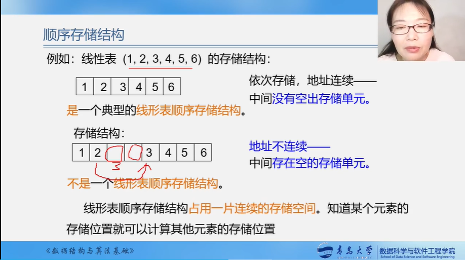

# 第 2 章 线性表

## 知识回顾

## 2.1 线性表的定义和特点

 

## 2.2 案例引入

## 2.3 线性表的类型定义

## 2.4 线性表的顺序表示和实现

## 补充：类C语言有关操作

> 之所以说数组的本质是指针，是因为在在具体实现上。数组是基于指针实现的，编译器只提供了数组首元素的地址。因此在访问时需要使用首地址+偏移量的形式，所谓的偏移量由下标决定。
>
> 假设存在数组a[10]，当我们访问第一个元素是可以使用a[0],也可以使用*a,或者*(a+0),，当我们访问第二个元素时可以使用a[1],同样的，指针表示为*(a+1),

> 因为malloc的返回值是一个void类型的指针，所以需要强制类型转换
>
> malloc 返回值void类型的指针，需要类型转换成对应数据类型的指针

## 2.4 线性表的链式表示和实现3

