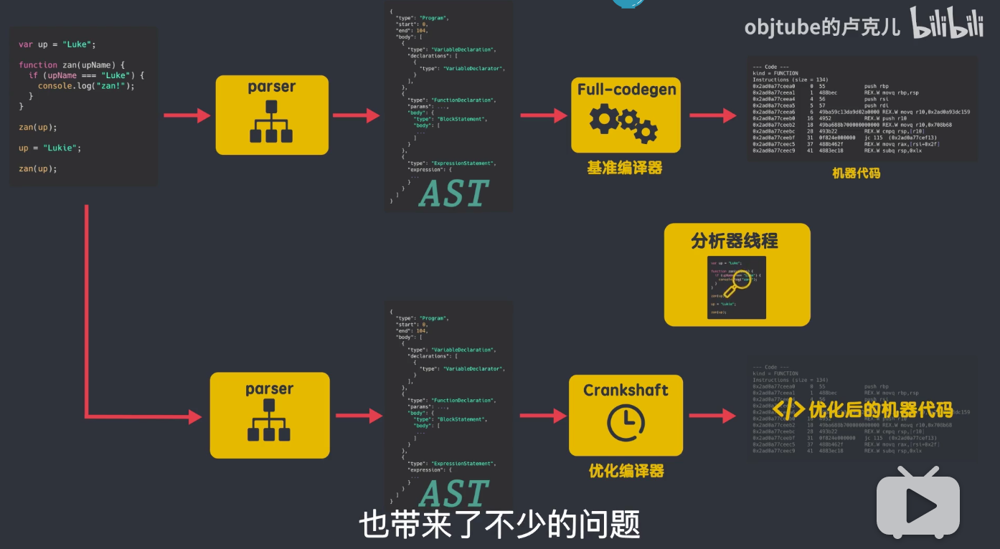
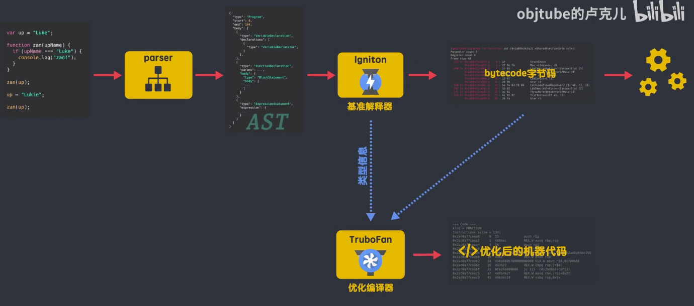

# V8 引擎是如何运行 JS 的

- [8 分钟带你了解 V8 引擎是如何运行 JS](https://www.bilibili.com/video/BV1zV411z7RX)

## 什么是 V8 引擎

V8 引擎是用 C++编写的 Google 开源高性能 JavaScript 和 WebAssembly 引擎，它用于 Chrome 和 Node.js 等。它实现了 ECMAScript 和 WebAssembly，并在 window7 或者更高版本，macON 10.12+ 和使用 x64，IA-32，ARM 或 MIPS 处理器的 liunx 系统上运行的。

简单来说，V8 就是一个接收 JavaScript 代码，编译代码然后执行的 C++程序，编译后的代码可以在多种操作系统多种处理器上运行。

V8 主要负责这些工作：

1. 编译和执行 JS 代码、处理调用栈
2. 内存分配
3. 垃圾收集

## V8 引擎是如何编译 js 代码的

一般来说，大部分的 js 引擎在编译和执行 js 代码时，都会用到三个重要的 js 组件，分别是解析器（parser）、解释器（interpreter）和编译器（compiler）。

1. 解析器（parser）负责将 js 源代码解析成抽象语法树（AST）；
2. 解释器（interpreter）负责将抽象语法树（AST）解释成字节码（bytecode）；同时解释器（interpreter）也有直接解释执行 bytecode 的能力；
3. 编译器（compiler）负责编译出运行更加高效的机器代码。

### 早期的 V8

但是在 v8 早期，v8 没有解释器（interpreter），却有 2 个编译器，它的编译流程是这样的：

js 又解析器解析生成抽象语法树，然后由 Full-codegen 编译器直接使用 AST 来编译出机器代码，而不进行任何中间转换；Full-codegen 编译器也被称为基准编译器，用它生成的是一个基准的未被优化的机器代码，这样做的好处就是当你第一次执行 js 的时候，就是直接使用高效的机器代码，因为没有中间的字节码产生，所以就不需要解释器，当代码运行一段时间后，v8 引擎的分析线程收集了足够的数据，来帮助另一个编译器 Crankshaft 来做代码优化。然后需要优化的源码重新解析生成 AST，然后 Crankshaft 使用生成好的 AST，再生成优化后的机器代码，来提升运行时的效率。所以编译器 Crankshaft 又被称为优化编译器。

这样设计的初衷是好的，减少额抽象语法树到字节码的转化时间，提高外部浏览器中 js 的执行的性能，但是这样的架构设计，也带来了不少的问题：

在 v8 团队的官方博客文章中提到了之前架构中的问题：

1. 生成的机器码占用了大量内存，对于低内存的设备基本是不能承受的；并且有些代码仅仅执行一次，没有必要直接生成机器码；
2. 缺少中间层的字节码，很多性能优化策略无法实施，导致 v8 性能提升缓慢；
3. 之前的编译器无法很好的支持和优化 js 的新语法特性



### 现在的 V8

v8 团队这样评价现在的 V8 引擎：

> 它代表了 V8 团队通过测量实际 JavaScript 性能并仔细研究 Full-codegen 和 Crankshaft 的缺点后收集的共同见解的顶峰。
>
> It represents the culmination of the collective insight that the V8 team has gleaned from measuring real-world JavaScript performance and carefully considering the shortcomings of Full-codegen and Crankshaft.

语法树的解析和之前保持一致的，但是在获得抽象语法树之后，v8 引擎加入了解释器 Ignition，语法树通过解释器 Ignition，生成了 bytecode 字节码，此时，AST 就被清除了，释放内存空间；生成的 bytecode 字节码直接被解释器执行，同时生成的 bytecode 字节码将作为基准执行模型，字节码更加简洁，生成的 bytecode 字节码大小相当于等效的基准机器代码的 25%-50%左右；在代码的运行过程中，解释器收到了很多可以用来优化代码的信息，比如变量的类型，那些函数执行的频率较高，这些信息发送给编译器 TurboFan，v8 引擎新的编译器 TurboFan 会根据这些信息和字节码来编译出经过优化的机器代码。



这里说几个 v8 引擎在处理 js 过程中的一些优化策略：

1. 如果函数只是声明未被调用，不会被解析生成 ast，也就不会生成字节码了
2. 如果函数只调用一次，则解释器 Ignition 生成字节码以后，就直接被解释执行了，TurboFan 不会进行优化编译，因为它需要 Ignition 收集函数执行时的类型信息，这就要求函数执行至少要大于 1 次，TurboFan 才能进行优化编译
3. 如果一个函数被调用多次，那么这个函数就被识别成热点函数，当解释器 Ignition 收集的类型信息确定后，这时 TurboFan 才会将 bytecode 编译成优化后的机器代码，以提高代码的执行性能，之后执行这个函数时，就直接执行优化后的机器代码。所以整体来说，就是出于一个运行字节码和优化的机器代码共存的一个状态，随着 js 源码不断的被执行，会有更多的源码被标记为热点代码，就会产生更多的机器代码。这里要注意的是，在某些情况下，优化后的机器代码，可能会被逆向还原成字节码，这个过程叫做 deoptimiation，这是因为 JavaScript 是一门动态语言，会导致解释器 Ignition 收集到的信息是错误的，比如：

```js
function sum(x, y) {
  return x + y;
}
// sum 函数被识别成热点函数，
// 解析器将收集到的类型信息 和 该函数对应的字节码发送给编译器，于是编译器生成优化后的机器代码中就假定了 x:int y:int 都是整形
// 之后遇到该函数的调用，就直接使用运行更快的机器代码
// 如果你此时，调用sum函数，你传入的字符串时， sun('90', '0')
// 机器代码不知道如何处理字符串参数，于是就需要进行deoptimiation，也就是回退到字节码，由解释器来解释执行，
sun(1, 2);
sun(3, 5);
sun('90', '0');
// 所以说我们不要把一个变量类型变来变去
// 对传入函数的参数类型最好保存固定，否则会给v8引擎带来一些影响，会损失一定性能
```

- 新的架构除了解决刚刚提出的 3 个问题， 还带来了什么好处？

  > 1. 由于不需要一开始编译成机器代码，而是生成了中间成的字节码，字节码生成的速度远远大于机器码的，所以网页初始化解析执行 js 的时间就缩短了，网页就可以更快的 onload 了
  > 2. 在生成优化机器代码时，不需要从源码重新编译，而是使用字节码，并且当需要 deoptimiation 时，只需要回归到中间层的字节码解释就可以了

新的架构的确在性能上面带来了很大的提升，并且更多功能模块的职能也更加清晰了，为未来 js 的新功能和优化也铺平了道路。
