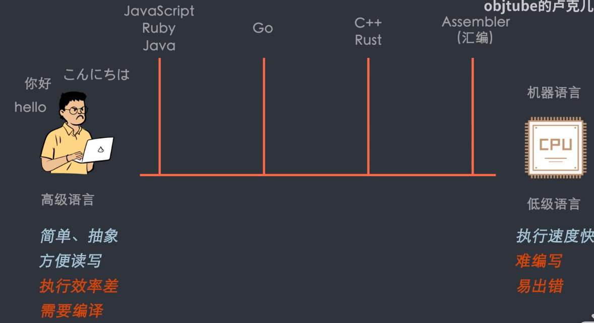
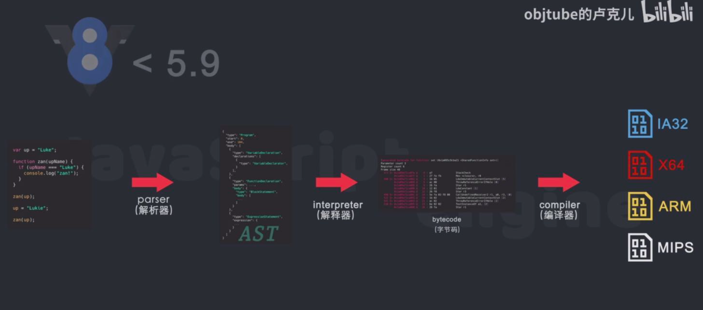

# JS 的运行原理

参看：[8 分钟带你了解 JS 运行原理](https://www.bilibili.com/video/BV1vh411Z7QG)

## 编程语言



JavaScript：

1. 借鉴了 C 语言的基本语法
2. 借鉴了 Java 语言的数据类型和内存管理
3. 借鉴了 Scheme 语言的函数式变成
4. 借鉴了 Self 语言的原型继承

所以 JavaScript 是函数式编程+面向对象编程的混合产物。

由于设计不严谨，导致了一系列问题：

```js
('b'+'a'+ + 'a'+'a'+ +'').toLowerCase() // "banana0"
0 == '0' //  true
0 == [] // true
'0' == [] // false
typeof NaN // number
99999999999// 100000000000
0.1+0.2==0.3// false 精度丢失
Math.max()// -Infinity 负无穷
Math.min()// Infinity 正无穷
[] + [] // ""
[] + {} // "【object object】"
{} + [] //  0
true + true + true===3 // true
true - true // 0
(!+[]+[]+![]).length // 9 "truefalse"
9 + "1" // 91
91 - "1" // 90
[] == false // true
0==false // true
undefined == false // true
NaN == false // true
"" == false // true 包括多空格
null == false // true
```

js 里我们定义一个变量，是完全不必关心这个变量的类型；但是在 C++里面，声明一个变量必须提前声明这个变量的类型，并且赋正确的值；并且 js 可以任意修改一个变量的类型，这对编译器就是一个噩梦：这是因为源代码中提供的信息太少了，让我们没有办法在运行期间知道变量的类型，只有在运行期间（runtime）才能确定各个变量的类型，这就导致了 js 无法在运行前编译出更加迅速的低级的语言代码，也就是机器代码（Machine Code）；相反的，在使用 C++编程时，你会提供足够的类型信息来帮助编译器编译出机器代码， 所以 C++并不是故意设计的这么难，而是为了更加高效的编译。

js 是动态语言，但是执行的依然很快，尤其是启动时，这是因为现代的 js 引擎都采用了一种叫“Just In Time Compilation”（JIT）运行时编译，JIT 就是在运行阶段生成机器代码，而不是提前生成，JIT 就是把代码的运行和生成机器代码结合在一起的。在运行阶段收集类型信息，然后根据信息编译生成机器代码，之后在运行这些代码时，就直接使用生成好的机器代码。

那还有另外一种方式叫 Ahead Of Time（AOT）——静态类型语言 C++ 编译环境，运行前提前生成好机器代码

js 引擎：将 js 转化为低级的语言并执行；常见的 js 引擎：

> 1. 谷歌 V8
> 2. 苹果 - javaScriptCore
> 3. 火狐 - SpideMonkey
> 4. QuickJs
> 5. FaceBook - Hermes

他们的大致流程是差不多的：


