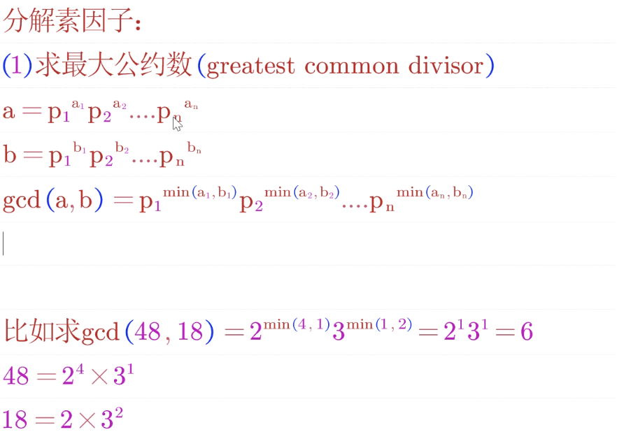
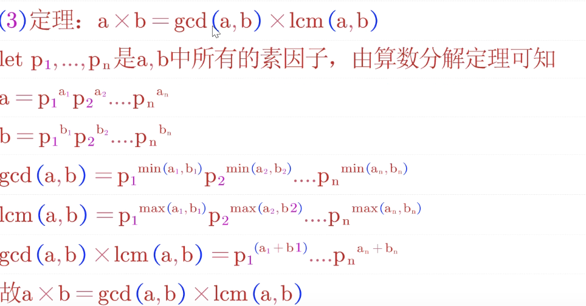

# 公约数和公倍数

参看：

1. [百度百科：最大公约数](https://baike.baidu.com/item/%E6%9C%80%E5%A4%A7%E5%85%AC%E7%BA%A6%E6%95%B0/869308?fr=aladdin)
2. [辗转相除法求最大公约数深度讲解](https://www.bilibili.com/video/BV1GE411n7vf)

## 1.质数和合数

**质数是指在大于 1 的自然数中，除了 1 和它本身以外不再有其他因数的自然数。**
**合数是指在大于 1 的整数中除了能被 1 和本身整除外，还能被其他数（0 除外）整除的数。与之相对的是质数，而 1 既不属于质数也不属于合数。最小的合数是 4。**

## 2.公约数

概念：多个整数共有约数中最大的一个（16 和 12 的最大公约数为 4），a，b 的最大公约数记为（a，b），同样的，a，b，c 的最大公约数记为（a，b，c），多个整数的最大公约数也有同样的记号。



求最大公约数有多种方法，常见的有质因数分解法、短除法、辗转相除法、更相减损法。

### [2.1 质因数分解法求公约数](https://baike.baidu.com/item/%E5%88%86%E8%A7%A3%E8%B4%A8%E5%9B%A0%E6%95%B0/2253749?fromtitle=%E8%B4%A8%E5%9B%A0%E6%95%B0%E5%88%86%E8%A7%A3&fromid=10305400)

把一个合数分解成若干个质因数的乘积的形式，即求质因数的过程叫做分解质因数。分解质因数只针对合数。

```js
/**
 * 列出小于等于某个数的全部质数
 * @param {number} maxValue | 30
 * @return {number[]} primes | [2,3,5, ...]
 */
function prime(maxValue) {
  let minPrime = 2;
  let primes = [minPrime];
  // 遍历所有数
  for (let i = 3; i <= maxValue; i++) {
    let isPrime = true;
    // 将遍历的数依次在找到的质数数组每一项取余，没有余数说明这个数不是质数，break本次循环，然后判断下一个数
    for (let p = 0; p < primes.length; p++) {
      if (i % primes[p] == 0) {
        isPrime = false;
        break;
      }
    }
    if (isPrime) {
      primes.push(i);
    }
  }
  return primes;
}
/**
 * 找出这个数的所有公约数
 * @param {number} v | 18
 * @return {number} results | [2, 3, 3 ]
 */
function decomposition(v) {
  let results = [];
  let primes = prime(v);
  console.log(primes);
  let tmp = v;
  for (let i = 0; i < primes.length; i++) {
    // 判断这个数是否等于 遍历的质数，是则终止循环
    if (tmp == primes[i]) {
      results.push(primes[i]);
      break;
    }
    // 这个数循环除以某个质数，将这个数中的相同质数取尽，然后将商重新赋值给 tmp，接着遍历下一个质数
    while (tmp % primes[i] == 0) {
      tmp /= primes[i];
      results.push(primes[i]);
    }
  }
  // 如果这个数的质因数数组长度为1，那么，这个数只有1和它本身2个质因数
  if (results.length == 1) {
    results = [];
    results.push(1);
    results.push(v);
  }
  return results;
}
console.log(decomposition(7));
```

## 3.最大公约数

### [3.1 短除法](https://baike.baidu.com/item/%E7%9F%AD%E9%99%A4%E6%B3%95)

求几个数最大公因数的方法，开始时用观察比较的方法，即：先把每个数的因数找出来，然后再找出公因数，最后在公因数中找出最大公因数。

### [3.2 辗转相除法](https://www.bilibili.com/video/BV1GE411n7vf?p=1)

```js
/**
 * @method gcd | 最大公约数
 * @param { Number } a | 40
 * @param { Number } b | 104
 * @return { Number } a和b的最大公约数 | 8
 */
const gcd = (a, b) => {
  // 利用es6数组解构方法巧妙地置换a和b的值，目的使a大于b
  if (a < b) [a, b] = [b, a];
  // 0 和 任何数的最大公约数都是这个数
  if (b === 0) return a;
  // 递归将除数和余数继续执行
  if (a % b !== 0) return gcd(b, a % b);
  // 返回最大公约数
  else return b;
};

// 调用
console.log(gcd(104, 40)); // 8
console.log(gcd(40, 104)); // 8
console.log(gcd(0, 40)); // 8
```

### [3.3 更相减损法](https://baike.baidu.com/item/%E6%9B%B4%E7%9B%B8%E5%87%8F%E6%8D%9F%E6%9C%AF/449183?fromtitle=%E6%9B%B4%E7%9B%B8%E5%87%8F%E6%8D%9F%E6%B3%95&fromid=10277459&fr=aladdin)

- 第一步：任意给定两个正整数；判断它们是否都是偶数。若是，则用 2 约简；若不是则执行第二步。
- 第二步：以较大的数减较小的数，接着把所得的差与较小的数比较，并以大数减小数。继续这个操作，直到所得的减数和差相等为止。 -则第一步中约掉的若干个 2 的积与第二步中等数的乘积就是所求的最大公约数。

```js
/**
 * @method gcd | 最大公约数
 * @param { Number } a | 40
 * @param { Number } b | 104
 * @return { Number } a和b的最大公约数 | 8
 */
function gcd(num1, num2) {
  if (num1 < num2) [num1, num2] = [num2, num1];
  if (num1 * num2 === 0) return num2;
  let minPrime = 1;
  while (num1 % 2 == 0 && num2 % 2 == 0) {
    num1 = num1 / 2;
    num2 = num2 / 2;
    minPrime *= 2;
  }
  let cha = num1 - num2;
  while (cha !== num2) {
    if (cha - num2 > 0) {
      num1 = cha;
    } else {
      num1 = num2;
      num2 = cha;
    }
    cha = num1 - num2;
  }
  return minPrime == 1 ? cha : cha * minPrime;
}

// 调用
console.log(gcd(104, 40)); // 8
console.log(gcd(40, 104)); // 8
console.log(gcd(0, 40)); // 8
```

## 4.最小公倍数

两个或多个整数公有的倍数叫做它们的公倍数，其中除 0 以外最小的一个公倍数就叫做这几个整数的最小公倍数。

### 4.1 分解质因数法

先把这几个数的质因数写出来，最小公倍数等于它们所有的质因数的乘积。


### 4.2 公式法

由于两个数的乘积等于这两个数的最大公约数与最小公倍数的积。即（a，b）×[a，b]=a×b。


