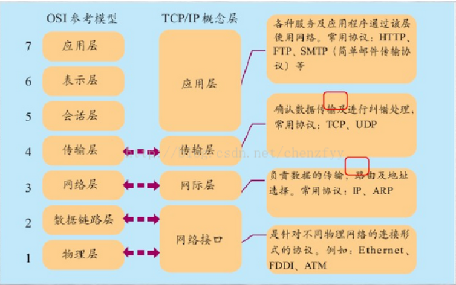

# 传输层上的 TCP 和 UDP

参考：

[知乎](https://zhuanlan.zhihu.com/p/24860273)

[传输层概述](https://blog.csdn.net/huabuxiu/article/details/79795150)

[“三次握手，四次挥手”你真的懂吗？](https://www.cnblogs.com/qcrao-2018/p/10182185.html)

TCP/IP 协议是一个协议簇。里面包括很多协议的，UDP 只是其中的一个， 之所以命名为 TCP/IP 协议，因为 TCP、IP 协议是两个很重要的协议，就用他两命名了。

传输层的主要功能： 为端到端连接提供可靠的传输服务，为端到端连接提供[流量控制](https://www.baidu.com/s?wd=%E6%B5%81%E9%87%8F%E6%8E%A7%E5%88%B6&tn=SE_PcZhidaonwhc_ngpagmjz&rsv_dl=gh_pc_zhidao)，差错控制，服务质量等管理服务，具有传输层功能的协议：TCP 、SPX 、NetBIOS。



TCP 和 UDP 是 OSI 模型中的传输层中的协议。

**TCP 定义**

TCP（Transmission Control Protocol [传输控制协议](https://www.baidu.com/s?wd=%E4%BC%A0%E8%BE%93%E6%8E%A7%E5%88%B6%E5%8D%8F%E8%AE%AE&tn=SE_PcZhidaonwhc_ngpagmjz&rsv_dl=gh_pc_zhidao)）是一种面向连接的、可靠的、基于字节流的传输层通信协议。

**UDP 定义**

UDP （User Datagram Protocol [用户数据报协议](https://www.baidu.com/s?wd=%E7%94%A8%E6%88%B7%E6%95%B0%E6%8D%AE%E6%8A%A5%E5%8D%8F%E8%AE%AE&tn=SE_PcZhidaonwhc_ngpagmjz&rsv_dl=gh_pc_zhidao)）是一种无连接的传输层协议，提供面向事务的简单不可靠信息传送服务。

区别：

TCP---[传输控制协议](https://www.baidu.com/s?wd=%E4%BC%A0%E8%BE%93%E6%8E%A7%E5%88%B6%E5%8D%8F%E8%AE%AE&tn=SE_PcZhidaonwhc_ngpagmjz&rsv_dl=gh_pc_zhidao),提供的是[面向连接](https://www.baidu.com/s?wd=%E9%9D%A2%E5%90%91%E8%BF%9E%E6%8E%A5&tn=SE_PcZhidaonwhc_ngpagmjz&rsv_dl=gh_pc_zhidao)、可靠的字节流服务。当客户和服务器彼此交换数据前，必须先在双方之间建立一个 TCP 连接，之后才能传输数据。TCP 提供超时重发，丢弃重复数据，检验数据，[流量控制](https://www.baidu.com/s?wd=%E6%B5%81%E9%87%8F%E6%8E%A7%E5%88%B6&tn=SE_PcZhidaonwhc_ngpagmjz&rsv_dl=gh_pc_zhidao)等功能，保证数据能从一端传到另一端。

UDP---[用户数据报协议](https://www.baidu.com/s?wd=%E7%94%A8%E6%88%B7%E6%95%B0%E6%8D%AE%E6%8A%A5%E5%8D%8F%E8%AE%AE&tn=SE_PcZhidaonwhc_ngpagmjz&rsv_dl=gh_pc_zhidao)，是一个简单的面向数据报的运输层协议。UDP 不提供可靠性，它只是把应用程序传给 IP 层的数据报发送出去，但是并不能保证它们能到达目的地。由于 UDP 在传输数据报前不用在客户和服务器之间建立一个连接，且没有超时重发等机制，故而[传输速度](https://www.baidu.com/s?wd=%E4%BC%A0%E8%BE%93%E9%80%9F%E5%BA%A6&tn=SE_PcZhidaonwhc_ngpagmjz&rsv_dl=gh_pc_zhidao)很快 。

使用场景：

TCP： 浏览器，SSH QQ 文件传输等

UDP：音频和多媒体应用，QQ 聊天，网络游戏和直播等

# 三次握手，四次挥手

tcp 头部结构：源端口 16 位；目标端口 16 位；序列号 32 位；回应序号 32 位；TCP 头长度 4 位；reserved 6 位；控制代码 6 位；口大小 16 位；偏移量 16 位；校验和 16 位；选项 32 位(可选)；


### 名词解释

1、ACK 是 TCP 报头的控制位之一，对数据进行确认。确认由目的端发出， 用它来告诉发送端这个序列号之前的数据段都收到了。 比如确认号为 X，则表示前 X-1 个数据段都收到了，只有当 ACK=1 时,确认号才有效，当 ACK=0 时，确认号无效，这时会要求重传数据，保证数据的完整性。

2、SYN 同步序列号，TCP 建立连接时将这个位置 1。

3、FIN 发送端完成发送任务位，当 TCP 完成数据传输需要断开时,提出断开连接的一方将这位置 1。

### 三次握手

- 第一次握手：客户端尝试连接服务器，向服务器发送 syn 包（同步序列编号 Synchronize Sequence Numbers），syn=j，客户端进入 SYN_SEND 状态等待服务器确认
- 第二次握手：服务器接收客户端 syn 包并确认（ack=j+1），同时向客户端发送一个 SYN 包（syn=k），即 SYN+ACK 包，此时服务器进入 SYN_RECV 状态
- 第三次握手：第三次握手：客户端收到服务器的 SYN+ACK 包，向服务器发送确认包 ACK(ack=k+1），此包发送完毕，客户端和服务器进入 ESTABLISHED 状态，完成三次握手

```
第一次握手： 主机A尝试连接服务器B，向服务器B发送含有**同步序列号额度标志位的数据段（就是 syn包 全称为 同步序列标号 Synchronize Sequence Numbers ），syn = j **，然后主机A进入SYN_SEND状态等待服务器B确认————“A对B说：请求通话？”


第二次握手： 服务器B接收到主机A发送的`syn`包并确定（ack = j + 1），然后给主机A返回一个数据段：SYN（syn = k）+ACK 包（其中包括同步序列标号syn 和 确定应答ACK），然后服务器B进入 SYN_RECV 状态————“B收到A的话，B对A说：你能听到吗？”


第三次握手： 主机A接收到 SYN+ACK包，向服务器B发送确定包ACK（ack = k + 1），此包发送完毕，主机A和服务器B进入ESTABLISHED状态，完成三次握手————“A听到B的话，A又对B说：我马上进入正题！”
```

第一次：主机 A 向主机 B 发送一个含有**同步序列号的标志位的数据段**给主机 B，向主句 B 请求建立连接，通过这个数据段，主机 A 告诉主机 B 两件事：**我要和你通信**，**你可以用哪个序列号作为起始数据段来回应我**。 ——请求通信和询问 B 的起始数据段

第二次：主机 B 收到主机 A 的请求后，用一个带有**确定应答（ACK）**和**同步序列号（SYN）的标志位**的数据段响应主机 A，同时也告诉主机 A 两件事：**我已经收到你的请求了，你可以传输数据给我了**和**你要用哪个序列号作为起始数据段来回应我**。——确定通信和询问 A 的起始数据段

第三次：主机 A 收到这个数据段后，再发送一个确认应答，确认已收到主机 B 的数据段：”我已经收到回复了，我现在要开始传输实际数据了。“这样 3 次握手就完成了，主机 A 和主机 B 就可以传输数据了。

**3 次握手的特点**：

- 没有应用层的数据
- SYN 这个标志位只有在 TCP 建立连接时才会被置 1
- 握手完成后 SYN 标志位被置 0

### 四次挥手

**TCP 建立连接要进行 3 次握手，而断开连接要进行 4 次**

第一次： 当主机 A 完成数据传输后,将控制位 FIN 置 1，提出停止 TCP 连接的请求 ；

第二次： 主机 B 收到 FIN 后对其作出响应，确认这一方向上的 TCP 连接将关闭,将 ACK 置 1；

第三次： 由 B 端再提出反方向的关闭请求,将 FIN 置 1 ；

第四次： 主机 A 对主机 B 的请求进行确认，将 ACK 置 1，双方向的关闭结束.。

由 TCP 的三次握手和四次断开可以看出，TCP 使用面向连接的通信方式， 大大提高了数据通信的可靠性，使发送数据端和接收端在数据正式传输前就有了交互， 为数据正式传输打下了可靠的基础。
