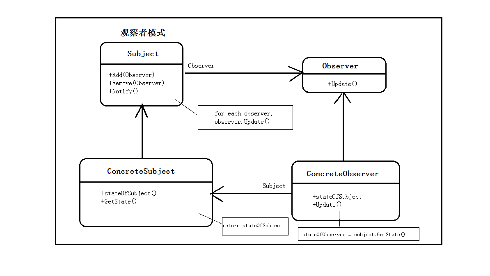

参考：

《JavaScript 设计模式》 P42

[人人都会设计模式：观察者模式--Observer](https://segmentfault.com/a/1190000012295887)

[原生 JavaScript 实现观察者模式](https://blog.csdn.net/lm278858445/article/details/78287492)

[JS 观察者模式](https://segmentfault.com/a/1190000012547812)

[观察者模式](https://segmentfault.com/a/1190000018260980)

## 什么观察者模式

第一次听到这个概念是在我刚学习 vue 的时候，现在已经过去快一年，vue 已经基本熟悉了，现在回过头来学习一下这个传说中的观察者模式。

**首先看一下概念：**



一个对象（称为 subject）维持一系列依赖于它的对象（观察者），将有关状态的任何变更自动通知给它们。

当一个目标需要告诉观察者发生什么有趣的事情，它会向观察者广播一个通知（可以包括与通知主题相关的特定数据）

当我们不再希望某个特定的观察者获得其注册目标发出的改变通知时，改目标可以将它从观察者列表中删除。

怎么理解呢？

将称为 subject 的被观察者对象视为老师；将一系列观察者视为学生。

当老师讲课时，学生聚精会神的听课——现在就是老师（被观察者）向学生（观察者）发出一个通知；

老师讲课时，某一个学生迟到，然后中途加入了听讲的学生行列——这时就是新增加一个观察者；

老师讲课时，某一个学生肚子疼，中途去了厕所——这时就可以认为删除了一个观察者。

好了通俗易懂的理解就到这里，现在看看书上的概念：

*Subject(目标，被观察者)：*维护一系列观察者，方便添加或删除观察者。

*Observer(观察者)：*为那些在目标（被观察者）发生改变时需获得通知的对象提供一个更新的接口。

*ConcreateSubject(具体目标)：*状态发生改变时，向 _Observer_ 发出通知，储存 _ConcreateSubject_ 的状态。

*ConcreteObserver(具体观察者)：*储存一个指向 _ConcreateSubject_ 的引用，实现 _Observer_ 的更新接口，以使自身状态与目标的状态保持一致。

那么再说一说常见的观察者模式的例子：

在前端业务中，浏览器的事件也是观察者模式

```javascript
div.onclick = function click() {
  alert('这就是一个简单的观察者事件');
};
```

- div 的 click 事件是被观察者
- function click 是观察者
- function click 订阅 div click 事件，事件发生时，对应的动作就是 alert()

## 代码实现

```js
let publisher = {
  subscribers: {
    any: []
  },

  // 将订阅者添加到 subscribers 中对应的数组中
  subscribe: function (fn, type = 'any') {
    if (typeof this.subscribers[type] === 'undefined') {
      this.subscribers[type] = [];
    }
    this.subscribers[type].push(fn);
  },

  // 在 subscribers 中删除订阅者
  unsubscribe: function (fn, type) {
    this.visitSubscribers('unsubscribe', fn, type);
  },

  // 循环遍历 subscribers 中的每个元素，并调用他们注册时提供的方法
  publish: function (publication, type) {
    this.visitSubscribers('publish', publication, type);
  },

  // 在 publish 调用
  visitSubscribers: function (action, arg, type = 'any') {
    this.subscribers[type].forEach((currentValue, index, array) => {
      if (action === 'publish') {
        // 函数调用
        currentValue(arg);
      } else if (action === 'unsubscribe') {
        if (currentValue === arg) {
          this.subscribers[type].splice(index, 1);
        }
      }
    });
  }
};

let funcA = function (cl) {
  console.log('msg1' + cl);
};

let funcB = function (cl) {
  console.log('msg2' + cl);
};

// 添加 订阅者 funcA
publisher.subscribe(funcA);
// 添加 订阅者 funcB
publisher.subscribe(funcB);
// 删除 订阅者 funcB
publisher.unsubscribe(funcB);

publisher.publish(' in publisher'); // msg1 in publisher
```

## 代码实现 2

```js
// 定义一个框架创建新的 Observer。这里的 Update 功能将在后面的自定义行为部分进一步介绍
// The Observer
function Observer() {
  this.Update = function () {
    // TODO
  };
}

// 模拟一个目标可能拥有的一系列依赖Observer
// 维护一个观察者数组
function ObserverList() {
  this.observerList = [];
}

// 定义一个 push 方法
ObserverList.prototype.Add = obj => {
  return this.observerList.push(obj);
};

// 清空数组的方法
ObserverList.prototype.Empty = () => {
  return (this.observerList = []);
};

// 计算数组的长度
ObserverList.prototype.Count = () => {
  return this.observerList.length;
};

// 获取数组的某一项
ObserverList.prototype.Get = index => {
  if (index > -1 && index < this.observerList.length) {
    return this.observerList[index];
  }
};

// 将一个对象插入数组的开始或结束，返回数组的长度
ObserverList.prototype.Insert = (obj, index) => {
  let pointer = -1;
  if (index === 0) {
    this.observerList.unshift(obj);
    pointer = index;
  } else if (index === this.observerList.length) {
    this.observerList.push(obj);
    pointer = index;
  }
  return pointer;
};

// 判断一个对象是否在数组中，返回所在位置
ObserverList.prototype.IndexOf = (obj, startIndex) => {
  let i = startIndex;
  let pointer = -1;
  while (i < this.observerList.length) {
    if (this.observerList[i] === obj) {
      pointer = i;
    }
    i++;
  }
  return pointer;
};

// 删除数组的最后一个元素
ObserverList.prototype.RemoveIndexAt = index => {
  if (index === 0) {
    this.observerList.shift();
  } else if (index === this.observerList.length - 1) {
    this.observerList.pop();
  }
};

// 使用 extension 扩展对象
function extend(obj, extension) {
  for (let key of obj) {
    extension[key] = obj[key];
  }
}

// 模拟目标（Subject）和在观察者列表上添加、删除或者通知观察者的能力
function Subject() {
  this.observers = new Objectlist();
}

Subject.prototype.AddObserver = function (observer) {
  this.observers.Add(observer);
};

Subject.prototype.RemoveObserver = function (observer) {
  this.observers.RemoveIndexAt(this.observers.indexOf(observer, 0));
};

Subject.prototype.Notify = function (context) {
  var observerCount = this.observers.Count();
  for (var i = 0; i < observerCount.length; i++) {
    this.observers.Get(i).Update(context);
  }
};
```
