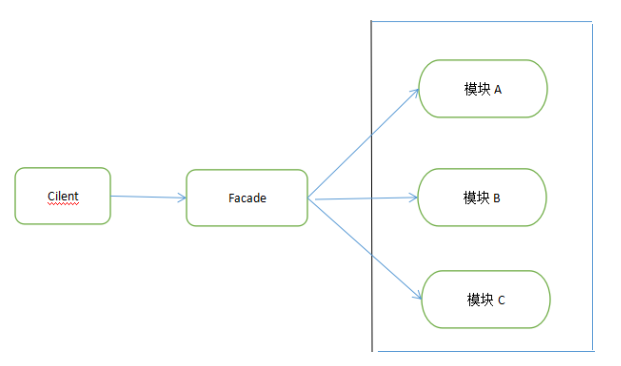
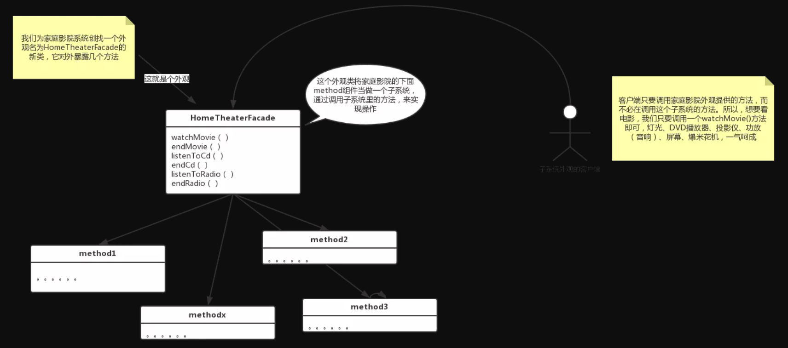
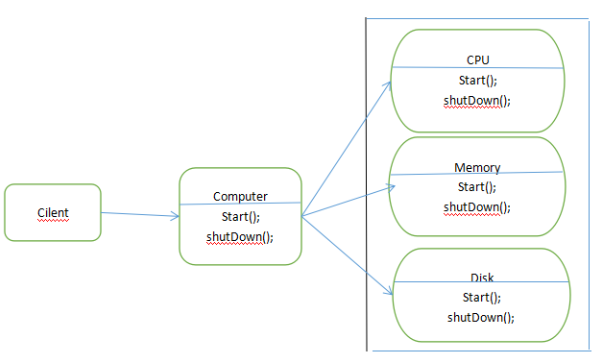

参看博客：

[java 设计模式之外观模式（门面模式）](https://www.cnblogs.com/lthIU/p/5860607.html)

[JS 外观模式](https://segmentfault.com/a/1190000012431621)

[JavaScript 设计模式系列八：外观模式](https://segmentfault.com/a/1190000014132789)

[维基百科](https://zh.wikipedia.org/zh-hans/%E5%A4%96%E8%A7%80%E6%A8%A1%E5%BC%8F)

## 概念介绍

**外观模式(Facode pattern)**：是软件工程中常见的一种软件设计模式，他为子系统中的一组接口提供一个统一的高层接口，使得子系统更加容易使用。

特点：他隐藏了系统的复杂性，并向客户端提供一个可以访问系统的接口。这种类型的设计模式属于**结构性模式**。

## 角色及使用场景



外观模式就是把一些复杂的流程封装成一个接口供外部用户更简单的使用，这个模式中包含 3 个角色：

1、门面角色：外观模式的核心。它被客户端角色调用，它也是子系统角色的高层统一。内部根据客户角色的需求预定了几种功能的组合。

2、子系统角色：实现子系统的功能。他对客户角色和 Facade 是未知的。它内部可以有系统的相互交互，也可以由供外界调用的接口。

3、客户角色：通过调用 Facede 来完成要实现的功能。

### 使用场景

1. 为负责挖的模块或子系统提供外界访问的模块
2. 子系统相互独立
3. 在层析接口中，可以使用外观模式定义系统的每一层的入口

## 实例

### JavaScript

```javascript
// a.js
export default {
  getA (params) {
    // do something...
  }
}

// b.js
export default {
  getB (params) {
    // do something...
  }
}

// app.js  外观模式为子系统提供同一的高层接口
import A from './a'
import B from './b'
export default {
  A,
  B
}

```

```javascript
// 通过同一接口调用子系统

import app from './app';

app.A.getA(params);
app.B.getB(params);
```

菜鸟补充：我在 node 环境中运行始终报错，查了资料，原来 node 还没有支持 import 语法，最后在 vue-cli 中实现代码。:cry:

#### 与适配器模式的区别

适配器模式是将一个对象包装起来以改变其接口，而外观模式是将一群对象包装起来以简化其接口。
适配器是将接口转换为不同接口，而外观模式是提供一个统一的接口来简化接口。

### Java 1

使用家庭影院系统在家看一次大片：

> 1、打开爆米花机
> 2、开始爆米花
> 3、将灯光调暗
> 4、放下屏幕
> 5、打开投影仪
> 6、将投影仪的输入切换到 DVD
> 7、将投影仪设置在宽屏模式下
> 8、打开功放
> 9、将功放的输入设置为 DVD
> 10、将功放的设置为环绕立体声
> 11、功放音量调到中（5）
> 12、打开 DVD 播放器
> 13、开始播放 DVD

这样看一次大片是多么麻烦，这么多开关。现在使用外观模式通过实现一个合理的接口的外观类，让一个复杂的系统变得简单。



这里注意：

**外观不只是简化了接口，也将客户端从子系统中解耦，拖客户有需求依然可以使用单独的子系统，外观是为了简化接口。**

代码实现：[开发之路（设计模式八：外观模式）](https://segmentfault.com/a/1190000011229235)

### Java 2

每台 computer 都有 CPU、Memory、Disk。在 computer 开启和关闭的时候，相应的部件也会开启关闭。所以，使用了该外观模式，会使用户和部件之间解耦。



代码：[java 设计模式之外观模式（门面模式）](https://www.cnblogs.com/lthIU/p/5860607.html)
